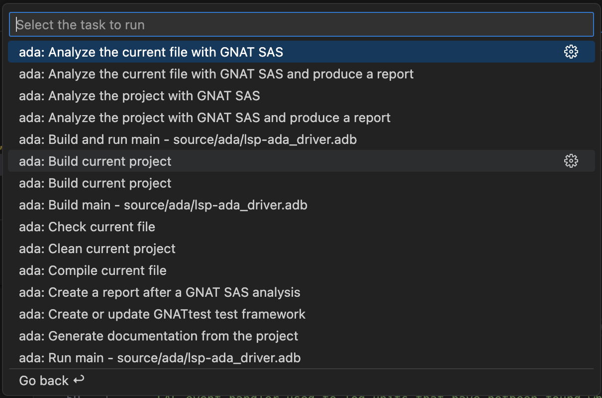
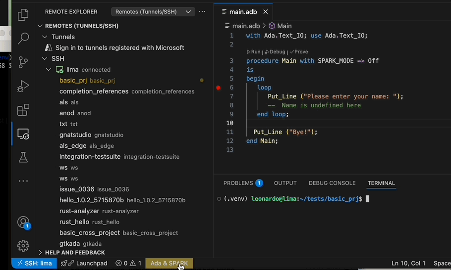
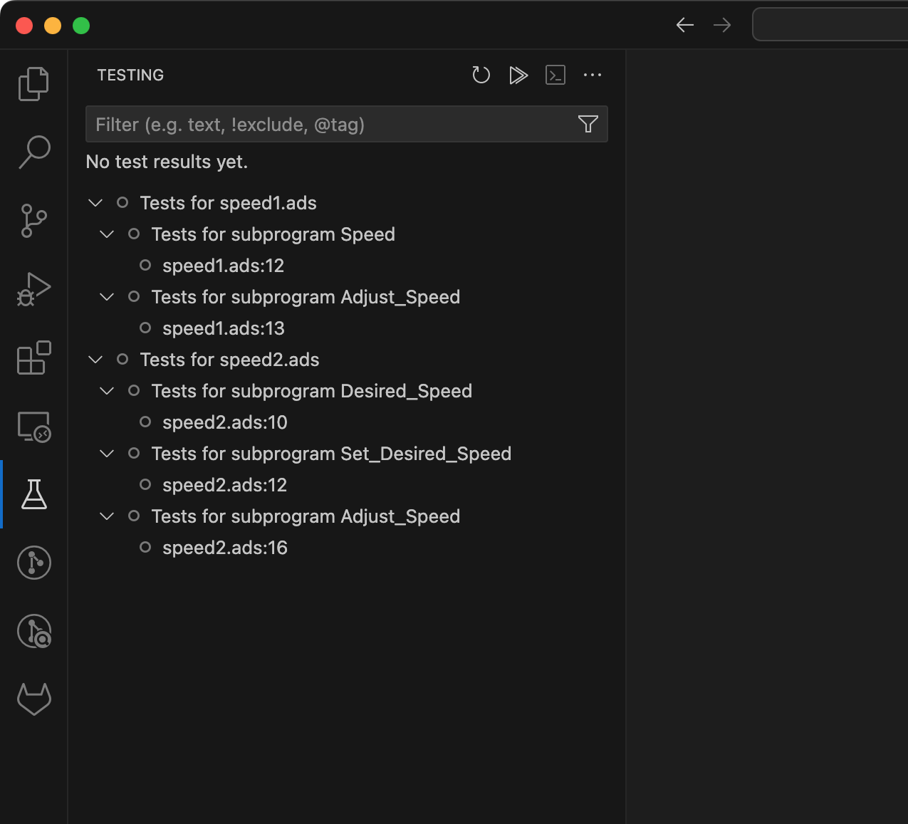
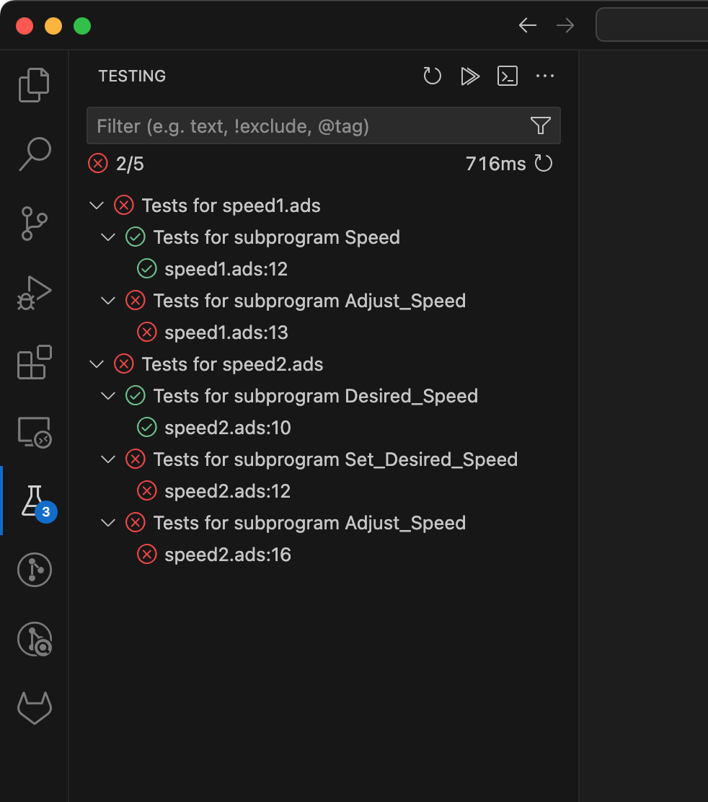
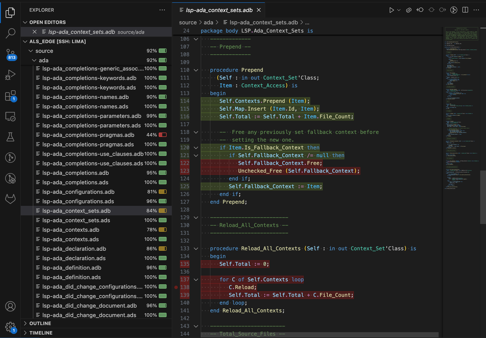
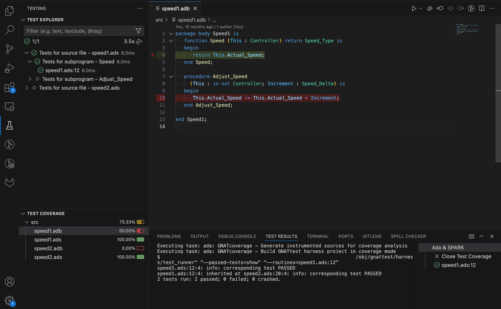
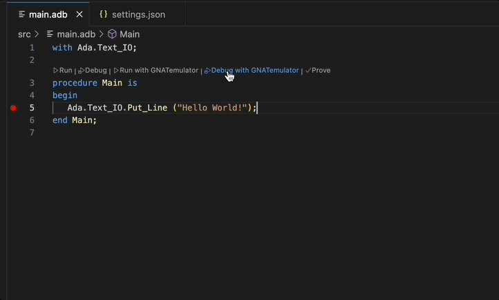

# Ada Language Server

[](https://github.com/AdaCore/ada_language_server/actions)
[](https://github.com/AdaCore/ada_language_server/releases)
[](https://marketplace.visualstudio.com/items?itemName=AdaCore.ada)
[](https://open-vsx.org/extension/AdaCore/ada)
[](https://gitpod.io/#https://github.com/AdaCore/ada_language_server/tree/edge)

This repository contains an implementation of the [Microsoft Language Server Protocol](https://microsoft.github.io/language-server-protocol/)
for Ada/SPARK and GPR project files.

Current features (general):

* [GNAT project files](https://docs.adacore.com/gprbuild-docs/html/gprbuild_ug/gnat_project_manager.html) support.
* Basic [Alire](https://alire.ada.dev/) support.

For Ada/SPARK, we provide the following:

* Code completion for names, keywords, aggregates, etc.
* Code navigation, such as Go to Definition/Declaration, Find All References, Call Hierarchies, etc.
* [Code refactoring](#refactoring-tools) like insert named associations, auto-add `with`-clauses, etc.
* Document/Workspace symbol search.
* Code folding and formatting.

The Ada Language Server now also supports the GPR language, via the
`--language-gpr` option, providing support for the most used LSP features
such as navigation, outline and tooltips for GPR files. When this switch is
present, the server will only support GPR files. To support both GPR and
Ada/SPARK, you'll need to launch two instances of the server.
You can refer to the [Supported LSP Server Requests](#supported-lsp-server-requests)
section for more information.

We also provide [Visual Studio Code](https://code.visualstudio.com/)
extension at
[the VS Marketplace](https://marketplace.visualstudio.com/items?itemName=AdaCore.ada) and at
[the Open VSX Registry](https://open-vsx.org/extension/AdaCore/ada).

## Table of Contents

- [Ada Language Server](#ada-language-server)
  - [Table of Contents](#table-of-contents)
  - [Install](#install)
  - [Usage](#usage)
    - [Memory Consumption](#memory-consumption)
  - [Supported LSP Server Requests](#supported-lsp-server-requests)
    - [Protocol Extensions](#protocol-extensions)
  - [VS Code Extension](#vs-code-extension)
    - [Getting Started](#getting-started)
    - [Configuration](#configuration)
    - [Refactoring](#refactoring)
    - [Tasks](#tasks)
      - [Task Customization](#task-customization)
      - [Tasks for Project Mains](#tasks-for-project-mains)
    - [Status Bar](#status-bar)
    - [Alire Support](#alire-support)
    - [GNATtest Support](#gnattest-support)
      - [Using multi-root workspaces for test development](#using-multi-root-workspaces-for-test-development)
      - [Limitations](#limitations)
    - [GNATcoverage Support](#gnatcoverage-support)
    - [Cross and Embedded Support](#cross-and-embedded-support)
      - [GNATemulator Support](#gnatemulator-support)
      - [Remote Debugging](#remote-debugging)
    - [Working with Multiple Projects in the Same VS Code Workspace](#working-with-multiple-projects-in-the-same-vs-code-workspace)
    - [Commands and Shortcuts](#commands-and-shortcuts)
      - [Ada: Go to other file](#ada-go-to-other-file)
      - [Ada: Add subprogram box](#ada-add-subprogram-box)
      - [Ada: Reload project](#ada-reload-project)
      - [Tasks with keyboard shortcuts](#tasks-with-keyboard-shortcuts)
    - [Bug Reporting](#bug-reporting)
    - [Limitations and Differences with GNAT Studio](#limitations-and-differences-with-gnat-studio)
  - [Integration with other editors and IDEs](#integration-with-other-editors-and-ides)
    - [Integration with Coc.NVim](#integration-with-cocnvim)
    - [Integration with vim-lsp](#integration-with-vim-lsp)
    - [Integration with LanguageClient-Neovim](#integration-with-languageclient-neovim)
    - [Integration with Neovim's built-in LSP client](#integration-with-neovims-built-in-lsp-client)
    - [Integration with emacs lsp-mode](#integration-with-emacs-lsp-mode)
    - [Integration with QtCreator](#integration-with-qtcreator)
    - [Integration with IntelliJ](#integration-with-intellij)
  - [Refactoring Tools](#refactoring-tools)
  - [Authors \& Contributors](#authors--contributors)
  - [Contribute](#contribute)
  - [License](#license)

## Install

The official [releases][releases] contains ready-built packages for
various platforms and architectures and should be your first choice when trying out the language server.

You can also build the language server from source. See [build.md](doc/devel/build.md) for details.

[releases]: https://github.com/AdaCore/ada_language_server/releases

## Usage

The `ada_language_server` doesn't require any command line options,
but it understands these options:

* `--tracefile=<FILE>` - Full path to a file containing traces configuration
* `--config=<FILE>` - Full path to a JSON file containing the server's configuration
* `--help` - Display supported command like options and exit.

You can turn some debugging and experimental features through
[the traces file](doc/traces.md).

The server also gets configuration via `workspace/didChangeConfiguration`
notification and `initializationOptions` of `initialize` request.
See more [details here](doc/settings.md). Each LSP
client provides its-own way to set such settings. You can use the `--config`
option if you want to provide the configuration directly via a JSON file
instead of specifying it via the requests listed just above.

### Memory Consumption

The `ada_language_server` relies on [Libadalang](https://github.com/AdaCore/libadalang) to compute the cross references.
Most of this computation is done while indexing which will create an internal cache.
The expected memory size of this cache is around 300Mb per 100k lines of Ada code.
Furthermore, 450Mb are necessary for the runtime.
Please note that some Ada structures like generics and tagged types might
increase the memory usage. This is also the case when using aggregate projects.
These measures were taken using both Resident Set Size and [Valgrind massif](https://valgrind.org/docs/manual/ms-manual.html) on Ubuntu 22.04LTS.

## Supported LSP Server Requests

See [WiKi page](https://github.com/AdaCore/ada_language_server/wiki/Supported-LSP-requests)
for the list of supported requests.

### Protocol Extensions

The Ada Language Server supports some features that are not in the official
[Language Server Protocol](https://microsoft.github.io/language-server-protocol)
specification. See [corresponding document](doc/README.md).

## VS Code Extension

A VS Code extension based on this Ada Language Server is available on the [Visual Studio Marketplace](https://marketplace.visualstudio.com/items?itemName=AdaCore.ada).
It provides a full set of features including syntax highlighting, navigation, building and debugging.

### Getting Started

Here are some links that will help you get familiar with the VS Code extension for Ada & SPARK:

* [Ada & SPARK for VS Code](integration/vscode/ada/README.md).
* [Tutorial: Using Ada in VS Code](https://github.com/AdaCore/ada_language_server/wiki/Getting-Started).

### Configuration

[ALS settings](doc/settings.md) can be specified in various ways. For example:

- A `.als.json` file at the root of the workspace.
- A global user configuration file `$HOME/.config/als/config.json`
- The `.vscode/settings.json` VS Code workspace settings file.
- A [multi-root VS Code workspace file](https://code.visualstudio.com/docs/editor/multi-root-workspaces)
- The User or Remote or other VS Code [scopes of of settings](https://code.visualstudio.com/docs/configure/settings#_settings-precedence)

The `.als.json` file is the preferred method of defining workspace-specific settings because it applies in any IDE or editor that uses ALS. More information about configuration files can be found [here](doc/settings.md).

Here is an example config file that sets the project file to use and the scenario variables, as well as other useful settings (charset, whether we should show file diagnostics etc.):

```json
{
   "projectFile": "gnatcov.gpr",
   "scenarioVariables": {
      "BINUTILS_BUILD_DIR": "/null",
      "BINUTILS_SRC_DIR": "/null"
   },
   "defaultCharset": "utf-8",
   "adaFileDiagnostics": false,
   "renameInComments": false
}
```

Alternatively, the ALS can be configured in the VS Code settings UI or in the JSON settings files. For example:

```json
{
   "ada.projectFile": "gnatcov.gpr",
   "ada.scenarioVariables": {
      "BINUTILS_BUILD_DIR": "/null",
      "BINUTILS_SRC_DIR": "/null"
   },
   "ada.defaultCharset": "utf-8",
   "ada.adaFileDiagnostics": false,
   "ada.renameInComments": false
}
```

### Refactoring

See a [dedicated document](doc/refactoring_tools.md) with the list of available refactorings.

### Tasks

The extension provides a number of auto-detected tasks under the `/Terminal/Run Task...` menu. These
predefined tasks are all prefixed by `ada:` and belong to the `ada` group.
They can be used to build and run your program (`ada: Build current project` task) or launch external tools such as GNAT SAS, GNATprove and a few others.



You can bind keyboard shortcuts to them by adding to the `keybindings.json` file:

```json
{
  "key": "alt+v",
  "command": "workbench.action.tasks.runTask",
  "args": "ada: Check current file",
  "when": "editorLangId == ada"
}
```

#### Task Customization

You can [customize auto-detected tasks](https://code.visualstudio.com/docs/editor/tasks#_customizing-autodetected-tasks)
by providing extra tool command line options via the `args` property of the object in the `tasks.json`:

```json
{
   "version": "2.0.0",
   "tasks": [
      {
         "type": "ada",
         "command": "gprbuild",
         "args": [
            "${command:ada.gprProjectArgs}",
            "-cargs:ada",
            "-gnatef",
            "-gargs",
            "-vh"
         ],
         "problemMatcher": ["$ada-error", "$ada-warning", "$ada-info"],
         "group": "build",
         "label": "ada: Build current project"
      }
   ]
}
```

You can also customize the working directory of the task or the environment variables via the `options` property:

```json
{
   "version": "2.0.0",
   "tasks": [
      {
         "type": "ada",
         "command": "gprbuild",
         "args": [
            "${command:ada.gprProjectArgs}",
            "-cargs:ada",
            "-gnatef"
         ],
         "options": {
            "cwd": "${workspaceFolder}/my/subdir",
            "env": {
               "MY_ENV_VAR": "value"
            }
         },
         "problemMatcher": ["$ada-error", "$ada-warning", "$ada-info"],
         "group": "build",
         "label": "ada: Build current project"
      }
   ]
}
```

#### Tasks for Project Mains

If your GPR project defines main programs via the project attribute `Main`, additional tasks are automatically provided for each defined main.
For example, if the project defines a `main1.adb` and `main2.adb` located under the `src/` source directory, two different tasks will be available to build a given main:

* `ada: Build main - src/main1.adb`
* `ada: Run main - src/main1.adb`

Same thing for all the predefined tasks that can have a main specified in their command line.

### Status Bar

A status bar item displaying the project-loading status and various useful commands provided by the Ada & SPARK extension (e.g `Ada: Reload Project` to reload a project after modifying it) is displayed on the left-side of the VS Code Status Bar.

  

### Alire Support

When the workspace is an Alire crate (i.e. it contains an `alire.toml` file), the extension uses Alire to determine the GPR project that should be loaded and to obtain an environment where the crate's dependencies have been provisioned.

Moreover when working with an Alire crate, VS Code tasks automatically use standard Alire commands. For example, the `ada: Build current project` task uses the command `alr build` and the `ada: Clean current project` task uses the command `alr clean`.

All other tasks use `alr exec -- ...` to execute the command in the environment provided by Alire.

### GNATtest Support

If you install GNATtest, the Ada & SPARK extension for VS Code will provide the following functionalities:

* The task `ada: Create or update GNATtest test framework` will call `gnattest` to create a test harness and test skeletons for your project automatically. You can use standard VS Code task customization to configure command line arguments to your liking in a `tasks.json` file.

* Once the test harness project is created, the task `ada: Build GNATtest test harness project` is provided automatically for building it. Command line arguments can be customized by configuring the task in a `tasks.json` file.

* Tests created with GNATtest will be loaded in the VS Code **Testing** view as follows.

  

* Tests can be executed individually or in batch through the available buttons in the interface, or through the `Test: Run All Tests` command or related commands.

* Test execution always starts by executing the `ada: Build GNATtest test harness project` task to make sure that test executables are up to date.

* Test execution results are reflected in the test tree.

  

#### Using multi-root workspaces for test development

When developing tests, it is recommended to use the test harness project auto-generated by GNATtest.
You can do so by editing the `ada.projectFile` setting to point to the test harness project.
However to avoid switching back and forth between the main application project and the test harness project,
see [Working with Multiple Projects in the Same VS Code Workspace](#working-with-multiple-projects-in-the-same-vs-code-workspace) for instructions on opening the test harness project in a separate VS Code window.

#### Limitations

* If you use a separate window to load the test harness project and edit tests, you have to go back to the main application project to benefit from the integration with the Test Explorer view (e.g. listing and searching for tests, running tests, etc...).
  This limitation is planned to be lifted.

* Sections of test sources delimited by `begin read only` and `end read only` comments are not really protected from inadvertant edits.
  To ensure proper interactions with GNATtest, you must refrain from making edits in those sections.

### GNATcoverage Support

GNATcoverage coverage reports can be imported in VS Code as follows:

1. Instruct GNATcoverage to produce an [XML report](https://docs.adacore.com/live/wave/gnatdas/html/gnatdas_ug/gnatcov/cov_source.html#xml-report-xml-xml)
2. Invoke the VS Code command `ada: GNATcoverage - Load an existing XML coverage report`
3. Browse to the location of the GNATcoverage XML report and select the `index.xml` file



Note that importing coverage reports does not require GNATcoverage to be installed. In particular, this enables a workflow where the coverage report is produced in CI and downloaded and imported into VS Code for visualization and analysis.

Since VS Code does not support reporting MC/DC level coverage natively, that information is imported as branch coverage.

The GNATtest integration in VS Code also supports running tests in coverage mode, if GNATcoverage is installed on the development machine.

1. Run the task `ada: GNATcoverage - Setup runtime library` once to set up the GNATcoverage runtime library
2. If you don't already have a test harness project created, use the task `ada: Create or update GNATtest test framework` to create one
3. Switch to the _Test Explorer_ view or use the `Testing: Focus on Test Explorer View` command to do that
4. Run the tests in coverage mode using the command `Test: Run All Tests with Coverage`, or use the "play" icon next to a single test or group of tests with the label _Run Test with Coverage_.
5. In one go, VS Code will:
   1. Invoke [GNATcoverage source instrumentation](https://docs.adacore.com/live/wave/gnatdas/html/gnatdas_ug/gnatcov/src_traces.html)
   1. Build the test harness project
   1. Run the tests
   1. Invoke [GNATcoverage source coverage analysis](https://docs.adacore.com/live/wave/gnatdas/html/gnatdas_ug/gnatcov/cov_source.html)
   1. Load the GNATcoverage report into VS Code



Integrating the steps of source instrumentation and test harness build into the test execution workflow allows for a quick feedback loop: run a test, observe results and coverage, edit the test or the tested code, repeat... In this context invoking the VS Code commands `Test: Rerun Last Run` and `Test: Rerun Last Run with Coverage` with their respective keyboard shortcuts can be valuable.

### Cross and Embedded Support

This section provides some guidance to work on cross or embedded projects. It assumes
that your `.gpr` project files are already properly configured to work on a cross environments/embedded platforms.

#### GNATemulator Support

If you have loaded an embedded project, the extension will automatically provide predefined tasks and commands
to run and debug your application through GNATemulator, if available for your target.

For instance if you have loaded a project with an `arm-eabi` target configured to run on a STM32F4
board, the extension will provide predefined tasks, commands and CodeLenses to run and debug your
program using GNATemulator.



The port used by the debugger launched by VS Code to connect to the running GNATemulator instance
is the one specified via the `Emulator'Debug_Port` project attribute: when not set, the extension
will fallback on `localhost:1234` (GNATemulator's default debug port).

Note that GNATemulator is not available for all GNAT embedded toolchains. For more information about GNATemulator itself and its availabilty please refer to the [GNATemulator User's Guide](https://docs.adacore.com/gnatemulator-docs/gnatemulator.html).

#### Remote Debugging

If your project can be debugged remotely via GDB using the `target remote <ip-of-target:port>` command, you will just need to set the `IDE'Program_Host` project attribute in your `.gpr` file to specify the address that should be used
to connect to your machine or board.

You will also need to run the debugging utility that spawns the remote `gdbserver` before launching the debugger in VS Code ( e.g: `st-util` or `openocd` for STM32F4 boards). This can be done directly through a VS Code `Terminal` or by configuring a custom [VS Code task](https://code.visualstudio.com/docs/editor/tasks) for that purpose.

Once your project is setup, just open the VS Code
`Run and Debug` panel and then click on the `Run and Debug` button.

For more advanced use cases or if your program cannot be debugged remotely via GDB, you can try creating your custom VS Code debug launch configuration following [VS Code User's Guide for Launch Configurations](https://code.visualstudio.com/docs/editor/debugging#_launch-configurations).

### Working with Multiple Projects in the Same VS Code Workspace

It is a possible for a workspace to contain multiple GPR projects.
For example, this is a typical scenario when working with GNATtest which generates (potentially multiple) test harness projects that contain test and stub sources that interface with the application code.
However, only one project can be loaded at a time with the `ada.projectFile` setting.
So you may find yourself switching back and forth between projects which can quickly become cumbersome.

This situation can be improved with [VS Code multi-root workspaces](https://code.visualstudio.com/docs/editing/workspaces/multi-root-workspaces). For example, in a workspace containing `prj1.gpr` and `prj2.gpr` it is possible to define the following two multi-root workspace files:

* `prj1.code-workspace`

  ```json
  {
    "folders": [
      {
        "path": "."
      }
    ],
    "settings": {
      "ada.projectFile": "prj1.gpr"
    }
  }
  ```

* `prj2.code-workspace`

  ```json
  {
    "folders": [
      {
        "path": "."
      }
    ],
    "settings": {
      "ada.projectFile": "prj2.gpr"
    }
  }
  ```

(while the name indicates _multi-root_, we are using a single root folder in each workspace)

Each of these workspaces can be opened in a different VS Code window, allowing to work on both projects side by side.
Alternatively, the root workspace materialized by `.vscode/settings.json` can be kept as the main workspace with `prj1.gpr`, and the other multi-root workspace is created as `prj2.code-workspace` for working with `prj2.gpr`.

In the use case of GNATtest, this allows us to load the main application project in a window and the test harness project in another window, and work on both simultaneously.

Note that a separate Ada Language Server instance is used for each VS Code window, so you might observe high memory consumption in this situation.

### Commands and Shortcuts

The extension contributes commands and a few default key bindings.
Below are a few examples, and other commands can be found by searching for `Ada:` in the command list.

#### Ada: Go to other file

This command switches between specification and implementation Ada files.
The default shortcut is `Alt+O`.

#### Ada: Add subprogram box

This command inserts a comment box before the current subprogram body.
The default shortcut is `Alt+Shift+B`.

#### Ada: Reload project

This command reloads the current project.
The default shortcut is `None`.

#### Tasks with keyboard shortcuts

The following default shortcuts are provided for tasks:

| Task                           | Shortcut        |
|--------------------------------|-----------------|
| `spark: Prove file`            | `Meta+Y Meta+F` |
| `spark: Prove subprogram`      | `Meta+Y Meta+S` |
| `spark: Prove selected region` | `Meta+Y Meta+R` |
| `spark: Prove line`            | `Meta+Y Meta+L` |

`Meta` = ⌘ on macOS, `Win` on Windows, `Meta` on Linux

These shortcuts can be customized and new shortcuts can be added for other tasks by using the command `Preferences: Open Keyboard Shortcuts (JSON)` and adding entries like the following example:

```json
{
    "command": "workbench.action.tasks.runTask",
    "args": "ada: Check current file",
    "key": "meta+y meta+c",
    "when": "editorLangId == ada && editorTextFocus"
}
```

### Bug Reporting

You can use the VS Code `Issue Reporter` to report issues. Just click on the `Help -> Report Issue` menu, select `An extension` for the `File on` entry and `Language Support for Ada` for the extension name. Put as many information you can in the description, like steps to reproduce, stacktraces or system information (VS Code automatically includes it by default). This will create a GitHub issue in the [Ada Language Server](https://github.com/AdaCore/ada_language_server/) repository.

ALS log files can be found under the `~/.als` directory (`%USERPROFILE%/.als` on Windows). Feel free to attach them on the issues, it helps a lot for further investigation, specially when the `ALS.IN` and `ALS.OUT` traces are enabled (more info about traces configuration can be found [here](doc/traces.md).)

### Limitations and Differences with GNAT Studio

The VS Code extension has a few limitations and some differences compared to [GNAT Studio](https://github.com/AdaCore/gnatstudio):

* **Indentation/formatting**: it does not support automatic indentation when adding a newline and range/document
formatting might no succeed on incomplete/illegal code.

* **Tooling support**: we currently provide support for some *SPARK*, *GNATtest*, *GNATcoverage*, *GNAT SAS* and *GNATemulator* [Tasks](#tasks), but some workflows may not be supported yet.

* **Alire support**: if the root folder contains an `alire.toml` file and
  there is `alr` executable in the `PATH`, then the language server fetches
  the project's search path, environment variables and the project's file
  name from the crate description. [Tasks](#tasks) are also automatically
  invoked with Alire in this case.

* **Project support**: there is no `Scenario` view: users should configure scenarios via the *ada.scenarioVariables* setting (see the settings list available [here](doc/settings.md)). Saving the settings file after changing the values will automatically reload the project and update the
predefined tasks to take into account the new scenario values.

  Source directories from imported projects should be added in a [workspace file](https://code.visualstudio.com/docs/editor/workspaces#_multiroot-workspaces). If you already have a workspace file, the extension will propose you to automatically add all the source directories coming from imported projects to your workspace automatically at startup.

## Integration with other editors and IDEs

### Integration with Coc.NVim

If you want to use the Ada Language Server with Vim/Neovim, you can use the
[Coc.NVim](https://github.com/neoclide/coc.nvim). You'll have to
[install](#install) the Ada Language Server manually somewhere on your
computer. Follow installation instructions on Coc.NVim website and then
configure the Ada Language Server with `:CocConfig`:

```json
{
  "languageserver": {
    "ada": {
      "settings": {
        "ada": {
          "projectFile": "gnat/vss_text.gpr"
        }
      },
      "command": "<path>/ada_language_server",
      "filetypes": [
        "ads",
        "adb",
        "ada"
      ]
    }
  }
}
```

Alternatively to the above settings section, workspace-specific [ALS Settings](doc/settings.md) such as the `projectFile` can be provided in a `.als.json` file at the root of the workspace.

### Integration with vim-lsp

If you want to integrate the Ada Language Server into vim, you can use the
[vim-lsp](https://github.com/prabirshrestha/vim-lsp).

You'll have to [install](#install) the Ada Language Server manually somewhere on your
computer, and then you can add the following line to your `.vimrc` file:

```viml
if executable('ada_language_server')
    au User lsp_setup call lsp#register_server({
        \ 'name': 'ada_language_server',
        \ 'cmd': ['ada_language_server'],
        \ 'allowlist': ['ada'],
        \ })
endif
```

Workspace-specific [ALS Settings](doc/settings.md) such as the `projectFile` can be provided in a `.als.json` file at the root of the workspace.

### Integration with LanguageClient-Neovim

If you want to integrate the Ada Language Server into Neovim, you can use the
[LanguageClient-neovim](https://github.com/autozimu/LanguageClient-neovim).

You'll have to [install](#install) the Ada Language Server manually somewhere on your
computer, and then you can add the following line to your `init.vim` file:

```viml
" replace the path below with the proper path to the ada_language_server executable
let g:LanguageClient_serverCommands = {
    \ 'ada': ['path/to/ada_language_server'],
    \ }
" if you already have LanguageClient_serverCommands, just add a line for ada.
```

Workspace-specific [ALS Settings](doc/settings.md) such as the `projectFile` can be provided in a `.als.json` file at the root of the workspace.

### Integration with Neovim's built-in LSP client

Neovim 0.5.0 and later have a built-in LSP client which can be used with the
Ada Language Server. In order to use it with minimal effort, follow these steps:

* Install the ada language server and make sure it's in your $PATH.
* Use your favorite Neovim plugin manager to add the default set of [LSP
  configuration files](https://github.com/neovim/nvim-lspconfig) to Neovim.
* Add `require('lspconfig').ada_ls.setup{}` to your init.lua in order to enable
  the Ada Language Server.

If you would rather not have the ada language server in your path, you can give
the lsp client an absolute path to the ALS executable:

```lua
require('lspconfig').ada_ls.setup{ cmd = "/path/to/als/executable" }
```

Configuring the language server's settings globally can be achieved like this:

```lua
require('lspconfig').ada_ls.setup{
  settings = {
    ada = {
      projectFile = "project.gpr";
      scenarioVariables = { ... };
    }
  }
}
```

Workspace-specific [ALS Settings](doc/settings.md) such as the `projectFile` can be provided in a `.als.json` file at the root of the workspace.

Alternatively, workspace-specific settings can also be configured as per the
[lspconfig wiki](https://github.com/neovim/nvim-lspconfig/wiki/Project-local-settings)

### Integration with emacs lsp-mode

Workspace-specific [ALS Settings](doc/settings.md) such as the `projectFile` can be provided in a `.als.json` file at the root of the workspace.

Alternatively the configuration for each project can be provided using a `.dir-locals.el`
file defined at the root of each project.

The scenario variables should be declared in your `.emacs` or any loaded
Emacs configuration file.

```elisp
(defgroup project-build nil
  "LSP options for Project"
  :group 'ada-mode)

(defcustom project-build-type "Debug"
  "Controls the type of build of a project.
   Default is Debug, other choices are Release and Coverage."
  :type '(choice
          (const "Debug")
          (const "Coverage")
          (const "Release"))
  :group 'project-build)
```

Your `.dir-locals.el` in the project root should be similar to:

```elisp
((ada-mode .
  ((eval . (lsp-register-custom-settings
      '(("ada.scenarioVariables.BINUTILS_SRC_DIR" project-binutils-dir)
        ("ada.scenarioVariables.BUILD_TYPE" project-build-type "Release"))))
   (lsp-ada-project-file . "/home/username/project/project.gpr"))
  ))
```

The [lsp-mode](https://github.com/emacs-lsp/lsp-mode) provides built-in support
for the `ada_language_server` and defines default customizable configuration
values in the `lsp-ada` group that can be edited similarly to
`lsp-ada-project-file` in the example above.

### Integration with QtCreator

Starting with version `4.9`, QtCreator supports a LSP plugin. Follow
[the official documentation](https://doc.qt.io/qtcreator/creator-language-servers.html)
to configure the Ada Language Server in this plugin. Make sure to set `Startup behavior`
to `Start Server per Project`, otherwise QtCreator won't provide the project root to
the Ada Language Server.

Workspace-specific [ALS Settings](doc/settings.md) such as the `projectFile` can be provided in a `.als.json` file at the root of the workspace.

### Integration with IntelliJ

The [LSP4IJ](https://plugins.jetbrains.com/plugin/23257-lsp4ij) IntelliJ plugin
provides a template for Ada since version `0.14.0`, allowing users tu use the Ada Language Server from IntelliJ.

Follow the [dedicated LSP4J documentation](https://github.com/redhat-developer/lsp4ij/blob/main/docs/user-defined-ls/ada_language_server.md) for more information.

## Refactoring Tools

See [corresponding document](doc/refactoring_tools.md).

## Authors & Contributors

* Maintained by [AdaCore](https://www.adacore.com).
* Original author [@MaximReznik](https://github.com/reznikmm).
* Support for the Visual Studio Code classifier and snippets contributed by [@Entomy](https://github.com/Entomy).

## Contribute

Feel free to dive in! Read the [developer's guide](doc/HACKING.md).

Don't hesitate to [open an issue](https://github.com/AdaCore/ada_language_server/issues/new) or submit PRs.

## License

[GPL-3](LICENSE)
