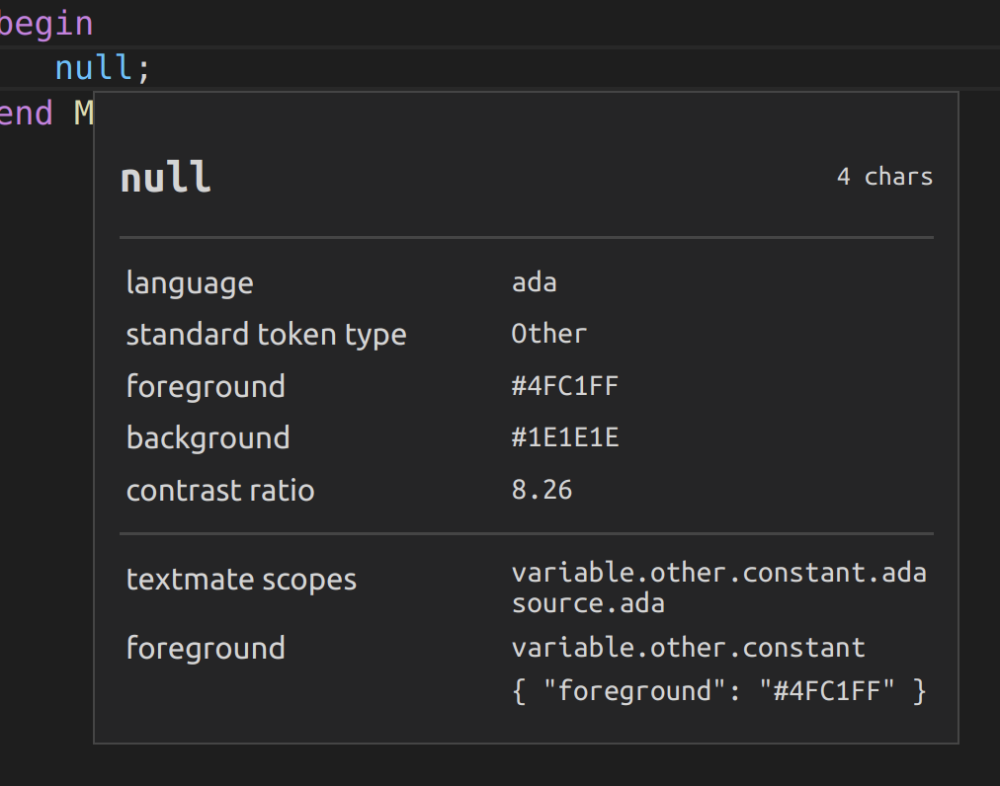
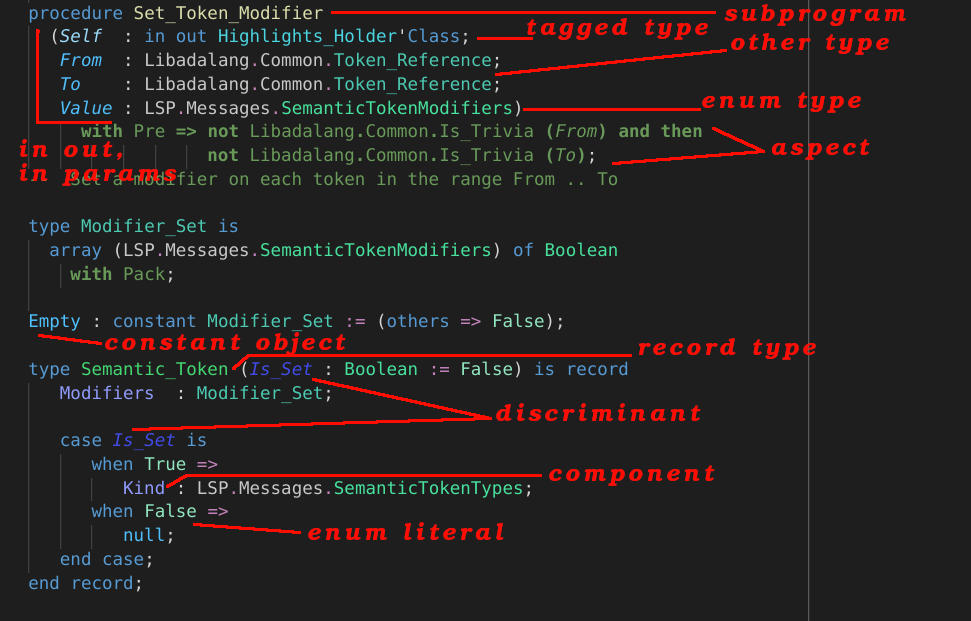

# Custom colors

Since 23.0.6 Ada Language Server provides
[Semantic token provider](https://code.visualstudio.com/api/language-extensions/semantic-highlight-guide).
The VS Code extension leverages it to colorize source code by mapping semantic colors to predefined "TextMate scopes".
See `semanticTokenScope` in the
[package.json](https://github.com/AdaCore/ada_language_server/blob/master/integration/vscode/ada/package.json).
But not all token types and modifier combination are visually distinguishable this way.

Users are welcome to [customize colors](https://code.visualstudio.com/docs/getstarted/themes#_customizing-a-color-theme) to visualize more token types and modifier combinations. This guide provides more details for this and a customization example.

In addition to semantic highlighting, users can customize syntax highlighting for keywords, strings, comments or numbers: syntax highlighting will be used for those when the corresponding tokens are not associated with any modifier. Syntax highlighting customization should be made via TextMate rules, which associate _scopes_ and a given style (color, font etc.). 

You can use the [Developer: Inspect editor tokens and scopes](https://www.youtube.com/watch?v=mC_htrJ1QPg&ab_channel=Code2020) command to know the scope of a given token (see the screenshot below). 



You can also find more documentation about TextMat scopes [here](https://macromates.com/manual/en/language_grammars).

## Supported token types

Ada Language Server uses next types of tokens:

| Token type    | Ada element                      |
|---------------|----------------------------------|
| namespace     | package
| class         | tagged type
| enum          | enumeration type
| interface     | interface type
| type          | any other type
| typeParameter | type discriminant
| parameter     | subprogram or generic parameter
| variable      | object declaration
| property      | component declaration
| enumMember    | enumeration literal
| function      | subprogram
| modifier      | any other identifier
| keyword       | keyword
| comment       | comment
| string        | string literal
| number        | numeric literal or named number
| operator      | operator

## Supported token modifiers

Ada Language Server uses next modifiers of tokens:

| Modifier       | Usage
|----------------|----------------------------------|
| declaration    | declaration with completion part
| definition     | body or completion for a declaration
| readonly       | constant or parameter with `in` mode
| static         | static subtype or function
| deprecated     | declaration with `Obsolescent` aspect/pragma
| abstract       | abstract type or subprogram
| modification   | write access to a name
| documentation  | ghost code or aspect
| defaultLibrary | predefined name

## Example

This example is based on Dark+ color theme. We have:

* **bold** writing for write access
* _italic_ writing for parameters, type discriminants, abstract entities and interfaces
* ~~strikethrough~~ writing for declaration with `Obsolescent` aspect/pragma
* constants and read-only names have a brighter color then variables and `in out` parameters
* ghost code is green as comments



Open `settings.json` and append next:

```json
    //  Syntax highlighting
    "editor.tokenColorCustomizations": {
        "textMateRules": [
            {
                "scope": "keyword",
                "settings": {
                    "foreground": "#569cd6"
                },
            },
            {
                "scope": "entity.name.operator",
                "settings": {
                    "foreground": "#cebff5",
                },
            },
            {
                "scope": "comment",
                "settings": {
                    "foreground":  "#6A9955"
                },
            },
            {
                "scope": "constant.numeric",
                "settings": {
                    "foreground": "#b5cea8",
                },
            },
            {
                "scope": "string",
                "settings": {
                    "foreground": "#ce9178",
                },
            }
        ]
    }

    //  Semantic highlighting
    "editor.semanticTokenColorCustomizations": {
        "[Default Dark+]": {
            "rules": {
                "namespace": "#C8C8C8",
                "type": "#4EC9B0",
                "class": "#4CD5E0",
                "enum": "#4CE099",
                "interface": {"foreground": "#4CD5E0", "italic": true},
                "struct": "#49D66A",
                "typeParameter": {"foreground": "#3E52EB", "italic": true},
                "parameter": {"foreground": "#9CDCFE", "italic": true},
                "variable": "#9CDCFE",
                "property": "#8F9DFF",
                "enumMember": "#93E6BE",
                "function": "#DCDCAA",
                "keyword": "#569cd6",
                "modifier": "#569cd6",
                "comment": "#6A9955",
                "string": "#ce9178",
                "number": "#b5cea8",
                "operator": "#C586C0",

                "*.abstract": {"italic": true},
                "*.modification": {"bold": true},
                "*.deprecated": {"strikethrough": true},
                "*.readonly": "#4FC1FF",
                "property.readonly": "#3E52EB",
                "typeParameter.readonly": {"foreground": "#3E52EB", "italic": true},
                "*.documentation": "#6A9955",

                "keyword.documentation": {"bold": true},
                "operator.documentation": {"bold": true}
            },
        }
    }

```
