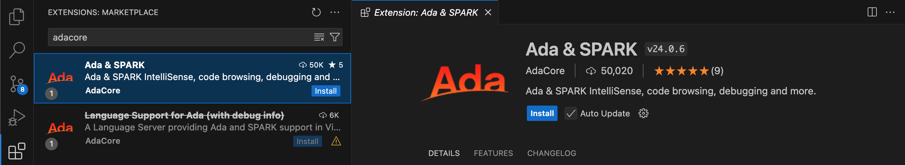
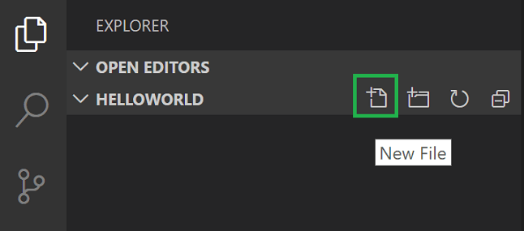
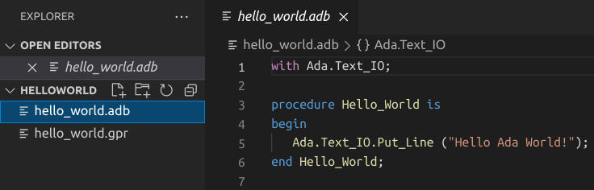
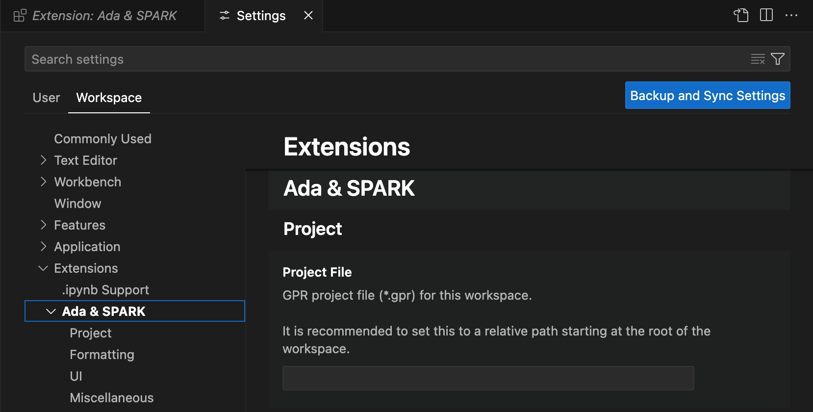
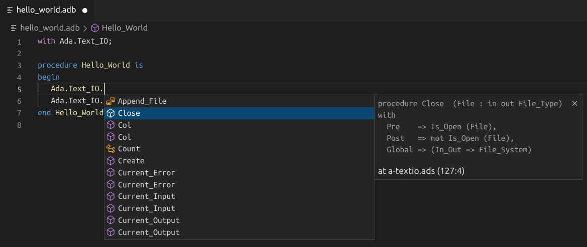
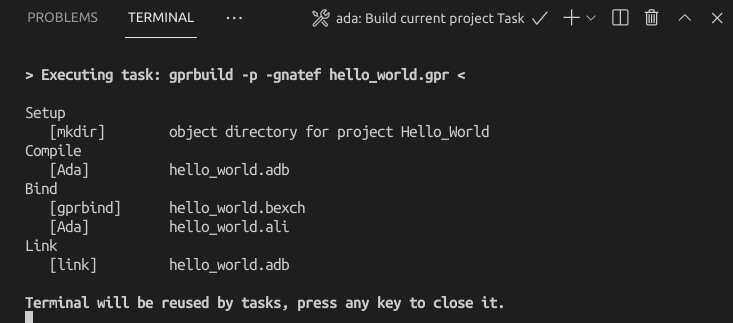
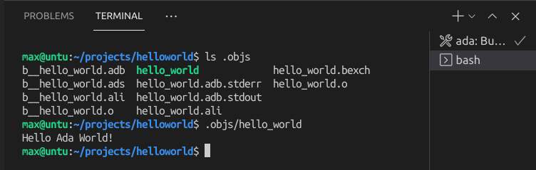
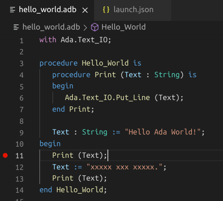
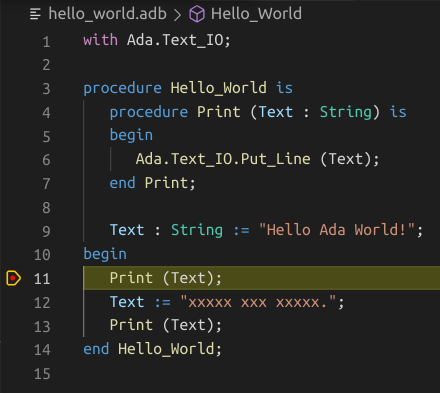
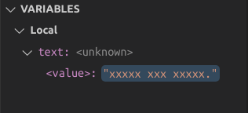

# Using Ada in VS Code

In this tutorial, you will configure Visual Studio Code to use the GCC
Ada compiler (GNAT) and GDB debugger on Linux, Windows or Mac OS X. GCC
stands for GNU Compiler Collection; GNAT is GNU Ada Translator in GCC;
GPRbuild is a multi-language builder; GDB is the GNU debugger.

After configuring VS Code, you will compile and debug a simple Ada project
in VS Code. This tutorial does not teach you GCC, GDB, Ubuntu or the Ada
language. For those subjects, there are many good resources available on
the Web.

If you have trouble, feel free to file an issue for this tutorial in the
ada_language_server
[repository](https://github.com/AdaCore/ada_language_server).

## Prerequisites

To successfully complete this tutorial, you must do the following:

* Install [Visual Studio Code](https://code.visualstudio.com/download).

* Install the
[Ada & SPARK extension for VS Code](https://marketplace.visualstudio.com/items?itemName=AdaCore.ada).
You can install the extension by searching for 'adacore' in the
Extensions view (`Ctrl+Shift+X`).

  

### Ensure GNAT is installed

Although you'll use VS Code to edit your source code, you'll compile the
source code using the GNAT compiler. You'll also use GDB to debug and
[gprbuild](https://docs.adacore.com/gprbuild-docs/html/gprbuild_ug/building_with_gprbuild.html)
to build applications or libraries. These tools are not installed by default,
so you have to install them. Fortunately, that's easy.

If you are an [AdaCore](https://www.adacore.com/) customer, log into your account on [GNAT Tracker](https://support.adacore.com/csm) to download the tools available in your subscription.

Otherwise, Ada & SPARK tools are available to the community through different channels listed [here](https://github.com/AdaCore/ada_language_server/tree/master/integration/vscode/ada#getting-additional-tools).

## Create Hello World

From the terminal window, create an empty folder called `projects` to
store your VS Code projects. Then create a subfolder called `helloworld`,
navigate into it, and open VS Code in that folder by entering the following
commands:

    mkdir projects
    cd projects
    mkdir helloworld
    cd helloworld
    code .

The `code .` command opens VS Code in the current working folder, which
becomes your "workspace".

### Create a project file

The
[GNAT project file](https://docs.adacore.com/gprbuild-docs/html/gprbuild_ug/gnat_project_manager.html)
allows you to manage complex builds involving a number of source files,
directories, and options for different system configurations. It is
recommended to create a project file even for the simplest Ada project.

In the File Explorer title bar, select **New File** and name the file
`hello_world.gpr`.



Paste in the following source code:

```
project Hello_World is
   for Main use ("hello_world.adb");
   for Object_Dir use ".objs";

   package Compiler is
      for Default_Switches ("Ada") use ("-g");
   end Compiler;
end Hello_World;
```

Now press `Ctrl+S` to save the file.

### Add hello world source code file

In the File Explorer title bar, select **New File** and name the file
`hello_world.adb`.

Paste in the following source code:

```ada
with Ada.Text_IO;

procedure Hello_World is
begin
   Ada.Text_IO.Put_Line ("Hello Ada World!");
end Hello_World;
```

Now press `Ctrl+S` to save the file. Notice that your files are listed
in the **File Explorer** view (`Ctrl+Shift+E`) in the side bar of VS Code:



You can also enable
[Auto Save](https://code.visualstudio.com/docs/editor/codebasics#_saveauto-save)
to automatically save your file changes, by checking **Auto Save** in the
main **File** menu.

The Activity Bar on the edge of Visual Studio Code lets you open different
views such as **Search**, **Source Control**, and **Run**. You'll look at
the **Run** view later in this tutorial. You can find out more about the
other views in the VS Code
[User Interface documentation](https://code.visualstudio.com/docs/getstarted/userinterface).

### Current project file configuration

It's important to configure the current project file setting. Open
**Settings View** with menu **File** > **Preferences** > **Settings**
(`Ctrl+Comma`), select **Workspace** tab, click **Extensions/Ada & SPARK**
and find the **Project File** input field. Type `hello_world.gpr`
value.



### Environment configuration

On first use, you may see the following warnings:

```
The project was loaded, but no Ada runtime found. Please check the installation of the Ada compiler.
can't find a toolchain for the following configuration: language 'Ada', target 'x86_64-linux', default runtime
```

This means that the GNAT compiler installation is not visible to VS Code. You can address this by setting up the `PATH` environment variable prior to opening VS Code, or by using the VS Code setting `terminal.integrated.env.[linux|windows|osx]`. Both methods are documented [on the extension's main page](https://github.com/AdaCore/ada_language_server/tree/master/integration/vscode/ada#environment-setup).

### Explore IntelliSense

In the `hello_world.adb` file, hover over `Put_Line` to see subprogram
information. After the begin keyword, start typing `Ada.Text_IO.` as
you would when calling a package procedure. You should immediately see
a completion list that shows all the subprograms in the package, and
a window that shows the entity information:



You can press the `Tab` key to insert the selected name. Then, when you
add the opening parenthesis, you'll see information about arguments that
the subprogram requires.

## Build hello_world

To build a simple project, you can use the `ada: Build current project`
predefined task. Predefined tasks are VS Code tasks that are created
by the extension itself.

To do that, just invoke the VS Code `Command Palette` via the 'Ctrl+Shift+B'
shortcut (or `Cmd+Shift+B` on Mac OS): then search for the `Run Task`
command and type `ada`. Clicking on the `ada` entry will show
you all the Ada related tasks, in particular the `ada: Build current project`
one. Select it and press ENTER (or click on it) to actually build your project.

If your are dealing with a complex project, that requires different build steps or
more advanced options, you can create a custom `tasks.json` file to tell VS Code
how to build (compile) the program. This task will invoke the `gprbuild` tool to
create an executable file from the source code.

From the main menu, choose **Terminal** > **Configure Default Build Task**.
A dropdown appears showing various predefined build tasks for Ada compilers.
Choose **ada: Build current project**.

This will create a `tasks.json` file in a `.vscode` folder and open it
in the editor.

Your new `tasks.json` file should look similar to the JSON below:

```json
{
   "version": "2.0.0",
   "tasks": [
      {
         "type": "ada",
         "command": "gprbuild",
         "args": [
            "${command:ada.gprProjectArgs}",
            "-cargs:ada",
            "-gnatef"
         ],
         "problemMatcher": [
            "$ada"
         ],
         "group": {
            "kind": "build",
            "isDefault": true
         },
         "label": "ada: Build current project"
      }
   ]
}
```

> Note: You can learn more about `tasks.json` variables in the
[variables reference](https://code.visualstudio.com/docs/editor/variables-reference).

The `command` setting specifies the program to run; in this case that
is `gprbuild`. The `args` array specifies the command-line arguments
that will be passed to `gprbuild`. These arguments must be specified
in the order expected by the tool.

This task tells `gprbuild` to take the project filename and associated scenario variables from the VS Code settings
(`${command:ada.gprProjectArgs}`), compile the project, and create an executable file
according to project file rules, resulting in `hello_world` for our example.

The `label` value is what you will see in the tasks list; you can name
this whatever you like.

The `"isDefault": true` value in the `group` object specifies that this
task will be run when you press `Ctrl+Shift+B`. This property is for
convenience only; if you set it to false, you can still run it from
the Terminal menu with **Tasks: Run Build Task**.

## Running the build

1. To run the build task defined in `tasks.json`, press `Ctrl+Shift+B`
or from the **Terminal** main menu choose **Run Build Task**.

2. When the task starts, you should see the Integrated Terminal panel
appear below the source code editor. After the task completes, the
terminal shows output from the compiler that indicates whether the
build succeeded or failed. For a successful g++ build, the output
looks something like this:



3. Create a new terminal using the `+` button and you'll have a terminal
running your default shell with the `helloworld` folder as the working
directory. Run `ls .objs` and you should now see the executable
hello_world (no file extension).



4. You can run `helloworld` in the terminal by typing `.objs/helloworld`.

## Check current file

Another task (`ada: Check current file`) could be used to
quickly check syntax and semantic of the current file in the editor.
If the compiler finds some errors VS Code will populate **Problems view**
and highlight corresponding lines in the editor. It's handy to have
a keyboard shortcut for this task. To create one:

* Click **View** > **Command Palette...** (`Ctrl+Shift+P`) and
type **Preferences: Open Keyboard Shortcuts (JSON)**

* Append this to the shortcut list:

  ```json
    {
        "key": "alt+v",
        "command": "workbench.action.tasks.runTask",
        "args": "ada: Check current file",
        "when": "editorLangId == ada"
    },
   ```

## Debug hello_world.adb

Let's try to debug our program now.

The [ms-vscode.cpptools](https://github.com/microsoft/vscode-cpptools) extension
is automatically installed along with this extension, allowing to use its
integration for GDB to debug Ada code.

The extension provides default debug configurations for all the mains of your
project. You can debug the executable of your choice by opening the
`Run and Debug` panel and then by clicking on the `Run and Debug` button.
You can also run directly the `Debug: Start Debugging` command instead of using the UI. In some circumstances the UI may offer a selection of languages, in which case select `Ada`.
The extension will then propose you to select the main you want to debug if your project contains several mains.

If you want to customize GDB's behavior or if you need to add custom arguments, you
will have to create a `launch.json` file: this can be done by click the gear icon
on the right side of one of the debug configurations proposed by the menu.
Alternatively, you can click the
`create a launch.json file` link button in the `Run and Debug` panel or use
the `Debug: Add Configuration` command.

Now let's replace `hello_world.adb` with something more complex:

```ada
with Ada.Text_IO;

procedure Hello_World is
   procedure Print (Text : String) is
   begin
      Ada.Text_IO.Put_Line (Text);
   end Print;
   
   Text : String := "Hello Ada World!";
begin
   Print (Text);
   Text := "xxxxx xxx xxxxx.";
   Print (Text);
end Hello_World;
```

By default, no breakpoints are added to
your source code. Let's put a breakpoint on the line with `Print` call.
To do this switch to the `hello_world.adb` tab in the code editor,
putting the insertion point somewhere on the `Print` statement,
and pressing `F9`. A red dot appears in the gutter on the left
to indicate that a breakpoint has been set on this line.



### Start a debugging session

1. Go back to `hello_world.adb` so that it is the active file.
2. Press `F5` or from the main menu choose **Run** > **Start Debugging**.
Before you start stepping through the code, let's take a moment to notice
several changes in the user interface:

   * The Integrated Terminal appears at the bottom of the source code
     editor. In the **Debug Output** tab, you see output that indicates
     the debugger is up and running.

   * The editor highlights the statement where debugger stops on the
     breakpoint:

     

   * The Run view on the left shows debugging information. You'll see
     an example later in the tutorial.

   * At the top of the code editor, a debugging control panel appears.
     You can move this around the screen by grabbing the dots on the
     left side

     

### Step through the code

Now you're ready to start stepping through the code.

1. Click `F10` or press the **Step over** icon in the debugging control panel.

   

   This will advance program execution to the assignment statement, and
   skip over the Print procedure call. See value of the `Text` variable
   on the left panel. Also take a look at **Debug Console** to see the
   `Put_Line` output.

2. Press **Step over** again to advance to the next statement in this
   program (skipping over assignment statement execution). Notice the
   change in the Variables window on the side.

   

3. To quickly view the value of any variable while execution is paused
   on a breakpoint, you can hover over it with the mouse pointer.

4. Try **Step Into** button to step in the `Print` procedure.

## Reusing your Ada configuration

VS Code is now configured to use Ada. The configuration applies to
the current workspace. To reuse the configuration for another project, just copy
the `.vscode` folder into the other project folder
(workspace) and change the names of the project file and
executables as needed.

Note that you can convert your `.vscode` folder into a workspace file (`.code-workspace` extension) if
you need a [Multi-root Workspace](https://code.visualstudio.com/docs/editor/workspaces#_multiroot-workspaces).
Multi-root workspaces allow to have workspaces containing multiple root folders: this is really useful for projects
that import other projects for instance. When loading such a project, the Ada extension will display a popup offering to automatically add all the source directories coming
from imported projects to the workspace.
That would then allow you to navigate quickly among imported sources via the `Ctrl+P` key shortcut.

## Troubleshooting

If you encounter issues while using Ada in VS Code, you may find useful information in the logs available in the **Output** view of VS Code. The logs can be accessed using the following commands:

* `Ada: Show extension output`
* `Ada: Show Ada Language Server output`
* `Ada: Show GPR Language Server output`

Verbosity of the language server outputs can be increased with the following settings:

```json
{
   "ada.trace.server": "verbose",
   "gpr.trace.server": "verbose"
}
```

You can report bugs via the `Help: Report Issue` command in VS Code, or by [opening an issue on GitHub](https://github.com/AdaCore/ada_language_server/issues/new?assignees=&labels=bug&projects=&template=bug-report.yaml&title=%5BBug%5D%3A+).

## Next steps

 * Explore the
   [VS Code User Guide](https://code.visualstudio.com/docs/editor/codebasics).
