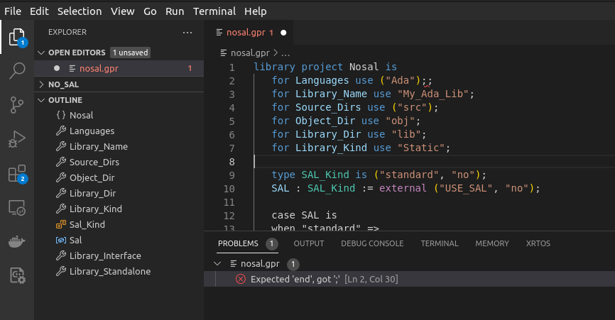

# GNAT Project files support

When `ada_language_server` is launched with `--language-gpr` it works as GPR language server.
In this mode it's able to provide:
* document symbols
* syntax and semantic errors as diagnostics

Take a look as VS Code use ALS in this mode:

