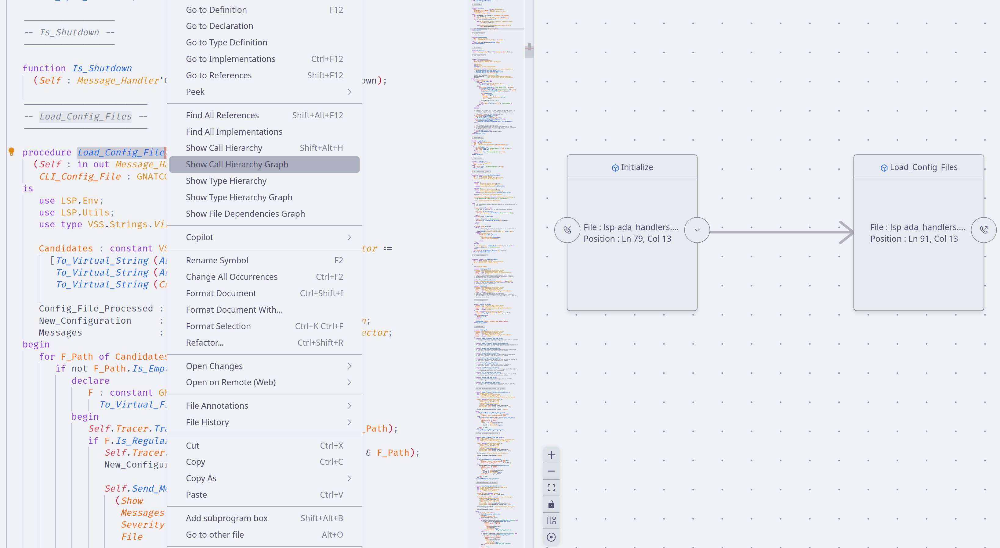
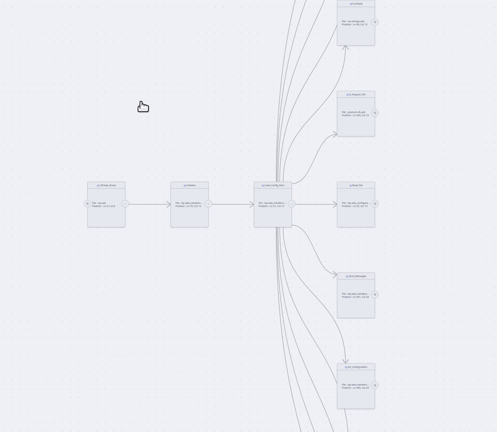
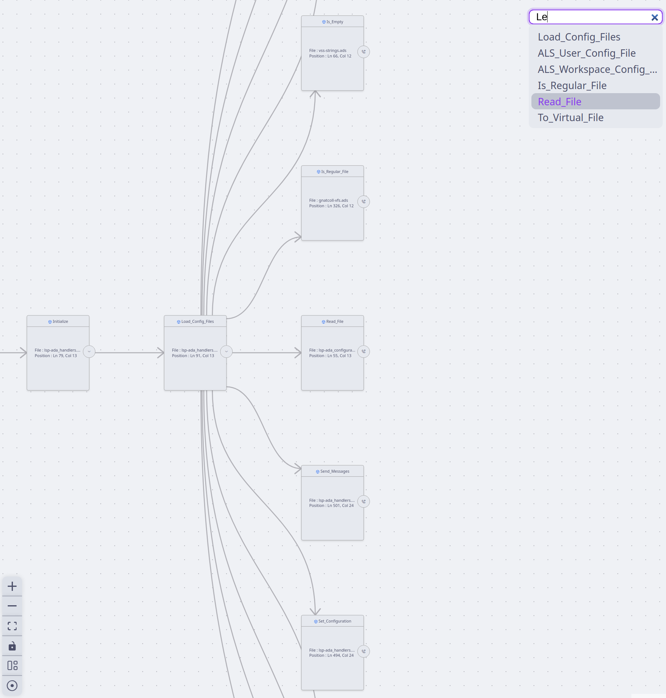
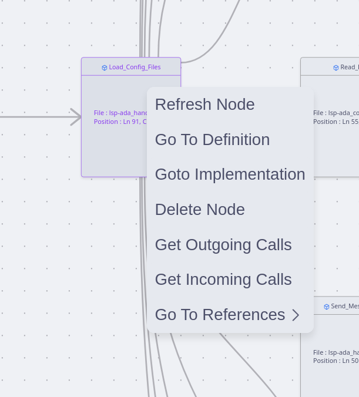
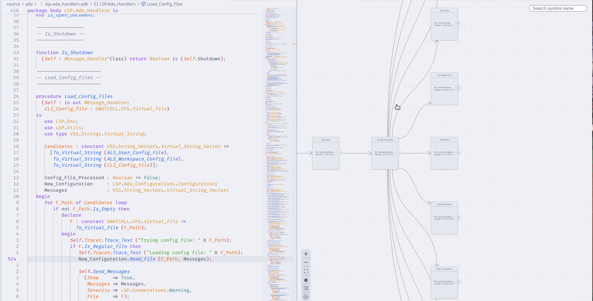

<!-- markdownlint-disable MD030 -->

# Code Visualizer for Visual Studio Code

The Ada & SPARK VS Code extension provides commands to display code information as interactive graphs using Language Server Protocol (LSP) requests.

## Features

The extension uses LSP to collect data for graphs, which means it works with any language that has a Language Server connected to VS Code.

**Note:** Language Servers implement the Language Server Protocol differently, so some features may not work perfectly for all languages. The extension is designed to work with *most languages*.

To address these differences, you can add [language-specific features](#multi-language-support).

### Graph Types

All the different commands display interactive graphs. Several types of graphs are available:

#### Call Graph

The Call Graph shows the relationships between function calls in your project.

**How to use:**

1. Right-click on a function symbol
2. Select `Show Call Hierarchy (graph)`

This opens a new tab with an interactive graph. You can move nodes around and use the features described below.

In this example, the graph starts from the `Load_Config_Files` function and shows an `Initialize` node, which is a parent (meaning `Initialize` calls `Load_Config_Files`).

#### Type Graph

The Type Graph shows hierarchies between different types in your project.

**How to use:**

1. Right-click on a type symbol
2. Select `Show Type Hierarchy (graph)`

#### File Dependency Graph (Ada)

Some graph types are language-specific. For Ada files, you can:

1. Right-click anywhere in the editor
2. Select `Show File Dependency (graph)`

This creates a graph showing relationships between Ada files.

#### GPR Dependency Graph (GPR)

For GPR files, you can visualize relationships between GPR files:

1. Click anywhere in a GPR file
2. Select `Show GPR Dependency (graph)`

The graph uses different visual styles:

- **Dotted edges**: Imported projects
- **Solid edges**: Extended projects
- **Sub-graphs**: Aggregated projects are shown as containers with their aggregated projects inside

### Viewport Navigation

You can interact with the graph viewport in several ways:

- **Move around**: Drag the viewport
- **Zoom**: Use the scroll wheel
- **Control buttons** (bottom left corner):
  - Zoom in/out buttons
  - Fit entire graph in view
  - Lock graph (prevents moving nodes)
  - Return to center (0,0)
  - Change layout direction (right-facing or downward)

### Expanding the Graph

To avoid performance issues, graphs initially show only the main symbols and their direct connections. You can expand the graph by:

- **Single expansion**: Click buttons on each node to show parents or children
- **Recursive expansion**: Hold the `Control` key while clicking to expand multiple levels at once

During recursive expansion, you'll see the graph grow in real-time. You can stop this process by clicking the cancel notification.

### Folding Nodes

Once a node has children, you can:

- **Fold**: Hide the children by clicking the fold button
- **Unfold**: Show hidden children again by clicking the same button

### Automatic Layout

When you add nodes, the graph automatically rearranges itself to keep everything visible and well-organized. If parts of the graph are disconnected, only the modified section is re-arranged.

You can also manually trigger layout changes using the `Layout Graph` button (bottom left), which also toggles between horizontal and vertical orientations.

### Search Functionality

As graphs grow larger, finding specific nodes becomes difficult. The search bar (top right corner) helps you locate nodes by name.

**How to use:**

1. Type characters in the search bar
2. A list of matching node names appears
3. Navigate with arrow keys or `Tab`
4. The graph automatically focuses on the highlighted node
5. Press `Enter` or click outside to close the search

### Node Context Menu

Right-clicking on any node opens a menu with these options:

- **Refresh node**: Update the node's information
- **Go To Definition**: Jump to where the symbol is defined
- **Go To Implementation**: Jump to the symbol's implementation
- **Delete Node**: Remove the node from the graph
- **Get Parents** (the actual label differs depending on the feature): Add parent nodes (e.g: outgoing calls for Call Graphs)
- **Get Children** (the actual label differs depending on the feature): Add child nodes (e.g: incoming calls for Call Graphs)
- **Go To References**: List and navigate to all references of the symbol

### Selecting Nodes

You can select nodes in multiple ways:

- **Single selection**: Click on a node
- **Multiple selection**: Hold `Control` and click multiple nodes
- **Area selection**: Hold `Shift` and drag to select a region

### Deleting Nodes

Remove nodes from the graph using:

- **Select nodes** and press `Backspace` or `Delete`
- **Recursive deletion**: Hold `Control` while deleting to also remove all children

**Note:** In circular references (A → B → C → A), recursive deletion only removes nodes that aren't parents of the deleted node.

### Refreshing Nodes

When you modify code while the graph is open, some symbols may move, making nodes invalid.

**Solution**: Right-click on affected nodes and select `Refresh Node` from the context menu.

**Important:** This tool is designed for code visualization and understanding, not active development. Making extensive code changes while the graph is open may invalidate many nodes.

### Navigating to Code

The graph provides several ways to jump to related code:

#### Go To Definition

- **Double-click** on a node (or use context menu)
- Opens the symbol's definition in an editor
- If already open, focuses on the correct position
- If not open, opens in a column next to the graph

#### Go To Implementation

- **Control + double-click** on a node (or use context menu)
- Jumps to the symbol's implementation

#### Go To References

Two ways to access references:

1. **Edge references**: Hover or click on an edge between nodes
   - Shows a popup with references in the specific context
   - Example: Edge from `Bar` to `Foo` shows all calls to `Foo` within `Bar`

2. **All references**: Use the context menu on a node
   - Shows all references to the symbol across the codebase
   - Organized by function name and file location

**Navigation**: Use arrow keys or `Tab` to move through the list, then press `Enter` to jump to a reference. You can also click directly on list items.

As you navigate the list, the relevant code appears in a side panel, giving you context about each reference.

**Note**: This feature works for Call Graphs and Type Graphs only, as GPR and File graphs don't have meaningful references.

### External Nodes

Sometimes LSP requests return symbols from external libraries (standard library, shared libraries, etc.) rather than your project code.

These external nodes are displayed with:

- **Different colors** from regular project nodes
- **Dotted borders** to indicate they're external

**Limitation**: External symbols may not have complete information, so some features might not work properly with these nodes.

### Multi-Language Support

This extension aims to work with any language that has a Language Server implementation.

However, each Language Server implements features differently, and each language has unique characteristics not covered by standard LSP requests.

**Solution**: The extension provides a *generic interface* with implementations that work for most languages. These can be customized for specific languages through sub-classes.

**Example**: The generic interface provides Call Graphs and Type Graphs for all languages, but the Ada-specific implementation adds the File Dependency Graph feature.
