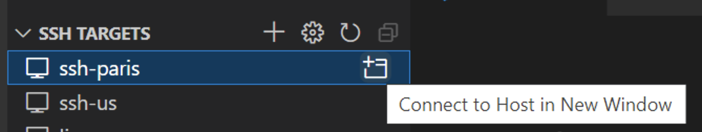

# Working on a remote machine

## Prerequisites

To successfully complete this tutorial, you must do the following:

* Install [Visual Studio Code](https://code.visualstudio.com/download).

* Install the
[Ada extension for VS Code](https://marketplace.visualstudio.com/items?itemName=AdaCore.ada).
You can install the Ada extension by searching for 'adacore' in the
Extensions view (`Ctrl+Shift+X`).

* Install the
[Remote - SSH](https://marketplace.visualstudio.com/items?itemName=ms-vscode-remote.remote-ssh) extension.
You can install it by searching for 'Remote - SSH' in the
Extensions view (`Ctrl+Shift+X`).

* Have an up and running SSH installation on both your host and remote platforms
(see the [extension's documentation](https://marketplace.visualstudio.com/items?itemName=ms-vscode-remote.remote-ssh) for more information about SSH requirements)

## Configure your SSH targets

Now that you have the plugin installed you can configure it to connect to a server. To do so, you’ll need the following pieces of information:

* The server’s IP or hostname.
* The username you’ll connect with.
* The private key you’ll use to authenticate your user.

You’ll use this information to create an SSH configuration file that VS Code can use to SSH to the server to sync files and execute code on your behalf.

To do that, open the `Remote Explorer` view and click on the toolbar `Configure` button. This will ask you to select a SSH configuration file, which lists all the needed information to connect to your remote machines.

After saving your SSH configuration file, you should now see all the servers in the `Remote Explorer` view.

## Connect to a remote machine

Just click on the `Connect to Host in New Window` to connect to the server of your choice. If a passphrase is needed, VS Code will ask for it via an input dialog. You can avoid typing your passphrase each time by following the instructions described [here](https://www.thegeekdiary.com/how-to-avoid-ssh-from-prompting-key-passphrase-for-passwordless-logins/).

Once you are connected, you will be able to open the workspace or folder of your choice and develop as if you were running VS Code locally.

To be able to build, run or debug your program, just make sure to setup the needed environment on your remote machine in your `.bashrc` or your `.bash_profile` files (e.g: setup your *PATH* to point to the needed toolchain).

**Note**: if you have any development extensions installed in VS Code, like the Ada extension, you will have to reinstall these extensions on your server through the `Extension Marketplace`. If you have already installed these extensions locally, when you search for them again, the `Marketplace` will say `Install on SSH: hostname`.

## Useful links

* Step-by-step tutorial on how to setup a Remote SSH dev environment: https://www.digitalocean.com/community/tutorials/how-to-use-visual-studio-code-for-remote-development-via-the-remote-ssh-plugin

* Another quick and simple tutorial: https://www.simplecode.io/blog/visual-studio-code-remote-ssh-quick-simple/

* VS Code documentation on Remote SSH development: https://code.visualstudio.com/docs/remote/ssh

## A short demo:

