# Refactoring Tools

## Available Refactorings

<!-- no toc -->
* [Named Parameters](#named-parameters)
* [Add Parameter](#add-parameter)
* [Remove Parameter](#remove-parameter)
* [Move Parameter](#move-parameter)
* [Change Parameter Mode](#change-parameter-mode)
* [Change Parameter Type](#change-parameter-type)
* [Change Parameter Default Value](#change-parameter-default-value)
* [Extract Subprogram](#extract-subprogram)
* [Extract Variable](#extract-variable)
* [Pull Up Declaration](#pull-up-declaration)
* [Sort Case](#sort-case)
* [Suppress Separate](#suppress-separate)
* [Delete Entity](#delete-entity)
* [Inline variable](#inline-variable)
* [Introduce Parameter](#introduce-parameter)
* [Replace Type](#replace-type)
* [Auto Import](#auto-import)
* [Sort Dependencies](#sort-dependencies)
* [Swap If/else statments](#swap-ifelse-statments)

## Named Parameters

**Command name:** `als-named-parameters`

* Adds the formal parameter name of each actual parameter in the subprogram call.

See `/source/ada/lsp-ada_handlers-named_parameters_commands.ads` in [ALS repository](https://github.com/AdaCore/ada_language_server).

Demo source is `named_parameters//` in [Code Samples](https://github.com/AdaCore/ada_language_server/blob/master/integration/vscode/Code%20Samples/refactoring_demos/).

## Add Parameter

**Command name:** `als-refactor-add-parameters`

* Adds a new parameter to a subprogram.
* All subprogram specs are updated.
* Only parameters with correct syntax are accepted.
* The new parameter type is infered when only the name is provided.
* The new parameter location is infered from the cursor position.

See `src/lal_refactor-subprogram_signature.ads` in [LAL Refactor repository](https://github.com/AdaCore/lal-refactor).

Demo source is `add_parameter//` in [Code Samples](https://github.com/AdaCore/ada_language_server/blob/master/integration/vscode/Code%20Samples/refactoring_demos/).

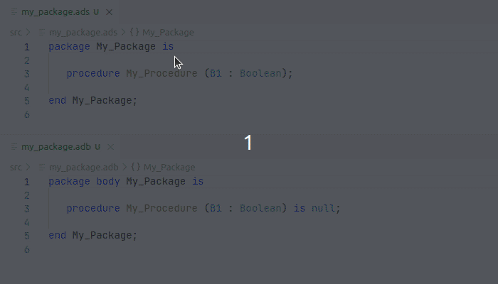

## Remove Parameter

**Command name:** `als-refactor-remove-parameters`

* Removes a parameter of a subprogram.
* All subprogram specs are updated.
* Actual parameter is removed from the subprogram calls.

See `src/lal_refactor-subprogram_signature-remove_parameter.ads` in [LAL Refactor repository](https://github.com/AdaCore/lal-refactor).

Demo source is `remove_parameter/` in [Code Samples](https://github.com/AdaCore/ada_language_server/blob/master/integration/vscode/Code%20Samples/refactoring_demos/).

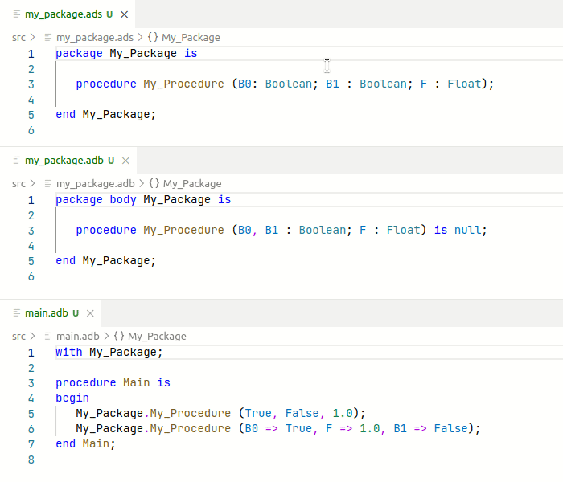

## Move Parameter

**Command name:** `als-refactor-move-parameters`

* Moves a parameter backward and forward within a subprogram spec.
* All subprogram specs are updated.
* Actual parameter are moved in the subprogram calls when needed.

See `src/lal_refactor-subprogram_signature.ads` in [LAL Refactor repository](https://github.com/AdaCore/lal-refactor).

Demo source is `move_parameter/` in [Code Samples](https://github.com/AdaCore/ada_language_server/blob/master/integration/vscode/Code%20Samples/refactoring_demos/).

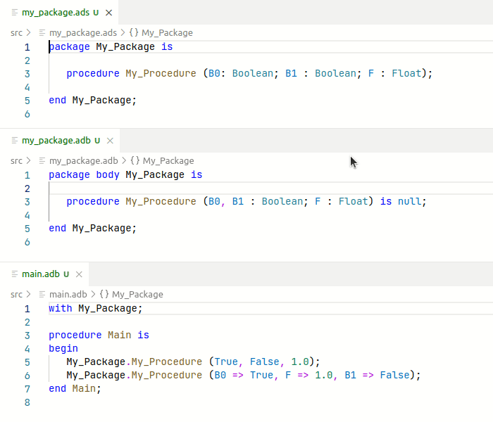

## Change Parameter Mode

**Command name:** `als-refactor-change-parameter-mode`

* Changes the parameter mode within a subprogram spec.
* All subprogram specs are updated.

See `src/lal_refactor-subprogram_signature.ads` in [LAL Refactor repository](https://github.com/AdaCore/lal-refactor).

Demo source is `change_parameter_mode/` in [Code Samples](https://github.com/AdaCore/ada_language_server/blob/master/integration/vscode/Code%20Samples/refactoring_demos/).

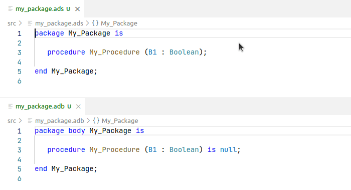

## Change Parameter Type

**Command name:** `als-refactor-change_parameters_type`

* Changes the parameter subtype indication within a subprogram spec.
* Only subtype indications with correct syntax are accepted.
* All subprogram specs are updated.

See `src/lal_refactor-subprogram_signature-change_parameters_type.ads` in [LAL Refactor repository](https://github.com/AdaCore/lal-refactor).

Demo source is `change_parameter_type/` in [Code Samples](https://github.com/AdaCore/ada_language_server/blob/master/integration/vscode/Code%20Samples/refactoring_demos/).

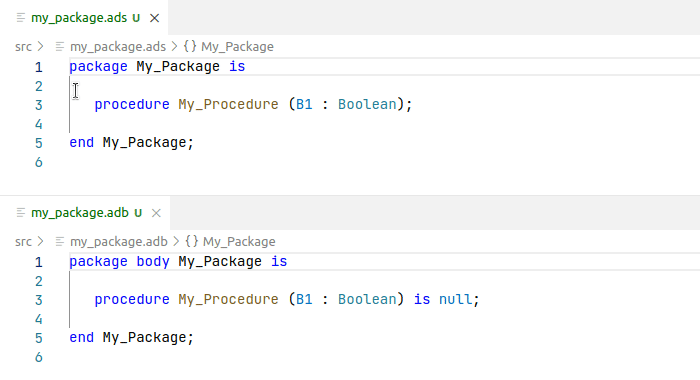

## Change Parameter Default Value

**Command name:** `als-refactor-change_parameters_default_value`

* Changes the parameter default value expression within a subprogram spec.
* Only default value expressions with correct syntax are accepted.
* All subprogram specs are updated.

See `src/lal_refactor-subprogram_signature-change_parameters_default_value.ads` in [LAL Refactor repository](https://github.com/AdaCore/lal-refactor).

Demo source is `change_parameter_default_value/` in [Code Samples](https://github.com/AdaCore/ada_language_server/blob/master/integration/vscode/Code%20Samples/refactoring_demos/).

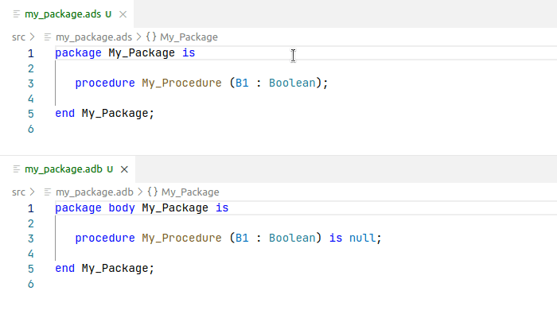

## Extract Subprogram

**Command name:** `als-refactor-extract-subprogram`

* Extracts statements to a new subprogram.
* The new subprogram is created in the nearest declarative part.
* Local declarations of for loop and exception handlers are passed to the extracted subprogram as new parameters.
* Extract function is available is the last statment is either an assignment or a return statment.

See `src/lal_refactor-extract_subprogram.ads` in [LAL Refactor repository](https://github.com/AdaCore/lal-refactor).

Demo source is `extract_subprogram/` in [Code Samples](https://github.com/AdaCore/ada_language_server/blob/master/integration/vscode/Code%20Samples/refactoring_demos/).

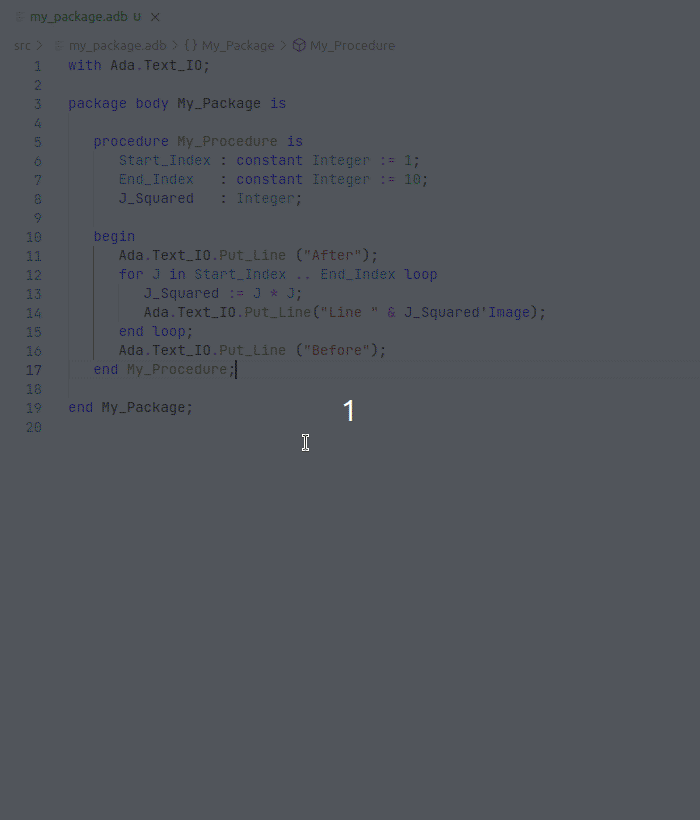

## Extract Variable

**Command name:** `als-refactor-extract-variable`

* Extract an expression to the new variable.
* The new variable is created in the nearest declarative part.
* The assignment is done as close to the original location as possible.

See `src/lal_refactor-extract_variable.ads` in [LAL Refactor repository](https://github.com/AdaCore/lal-refactor).

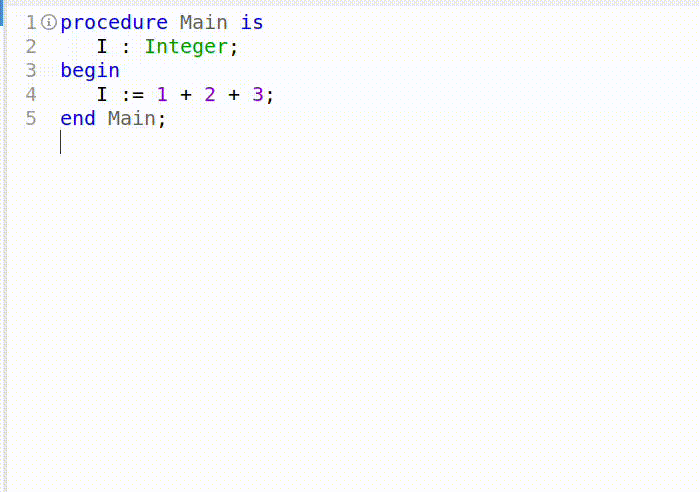

## Pull Up Declaration

**Command name:** `als-refactor-pull_up_declaration`

* Moves a declaration and its dependent declarations to their parent declarative part.
* When pulling up a subprogram, object declaration are not pulled up. Instead, they're added as formal parameters to the subprogram specification and as actual parameters to the subprogram calls.

See `src/lal_refactor-pull_up_declaration.ads` in [LAL Refactor repository](https://github.com/AdaCore/lal-refactor).

Demo source is `pull_up_declaration/` in [Code Samples](https://github.com/AdaCore/ada_language_server/blob/master/integration/vscode/Code%20Samples/refactoring_demos/).

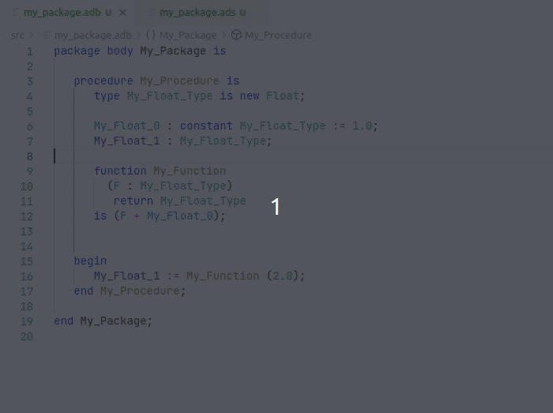

## Sort Case

**Command names:** `als-refactor-sort-case-alphabetical` `als-refactor-sort-case-declaration`

* Sort `when` and literals inside `when` alphabetically or according to the declaration order.

See `src/lal_refactor-sort_case.ads` in [LAL Refactor repository](https://github.com/AdaCore/lal-refactor).

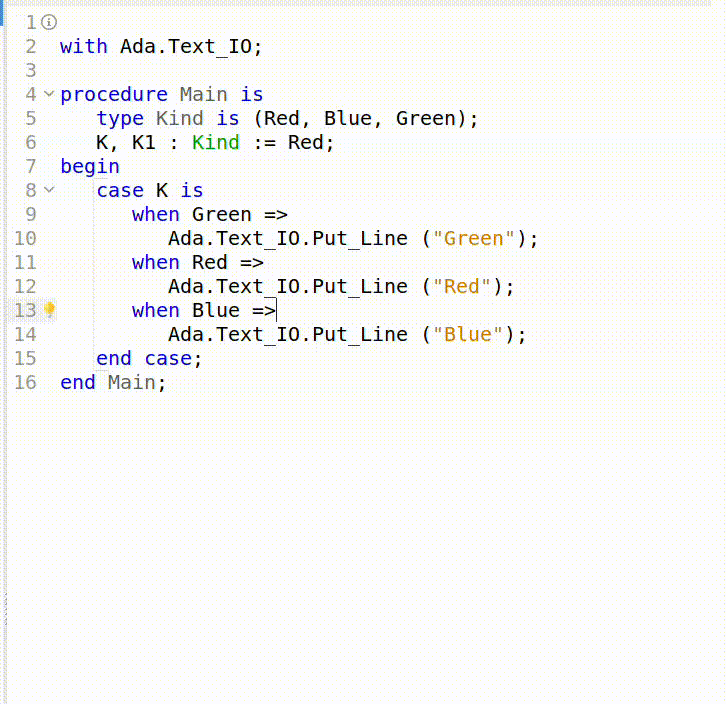

## Suppress Separate

**Command name:** `als-suppress-separate`

* Moves a separate subunit to it's stub in the parent package.
* Use clauses in the separate subunit are moved to the subprogram's declarative part to avoid namespace collisions.
* .bak is added to the separate subunit source filename.

See `src/lal_refactor-suppress_separate.ads` in [LAL Refactor repository](https://github.com/AdaCore/lal-refactor).

Demo source is `suppress_separate/` in [Code Samples](https://github.com/AdaCore/ada_language_server/blob/master/integration/vscode/Code%20Samples/refactoring_demos/).

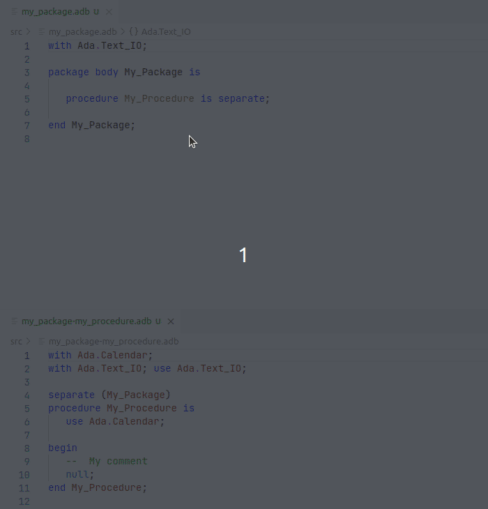

## Delete Entity

**Command name:** `als-refactor-delete-entiry`

* Currently works only for procedures.
* Any procedure call is also deleted.
* If call statement is the only one in the statement list, then
  - if it is inside a declare/block/end then the block statement is deleted
    even if there are exception handlers and declarations in it.
  - otherwise it will be replaced with `null;` to keep source correct.
* Non-call references will be reported and prevent the deletion.

See `src/lal_refactor-delete_entity.ads` in [LAL Refactor repository](https://github.com/AdaCore/lal-refactor).

Demo source is `delete_entity/` in [Code Samples](https://github.com/AdaCore/ada_language_server/blob/master/integration/vscode/Code%20Samples/refactoring_demos/).

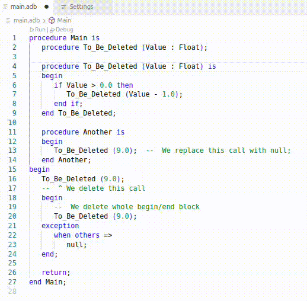

## Inline variable

**Command name:** `als-refactor-inline_variable`

* Delete the variable with the initialization expression and replace all
  references to this expression.

See `src/lal_refactor-inline_variable.ads` in [LAL Refactor repository](https://github.com/AdaCore/lal-refactor).

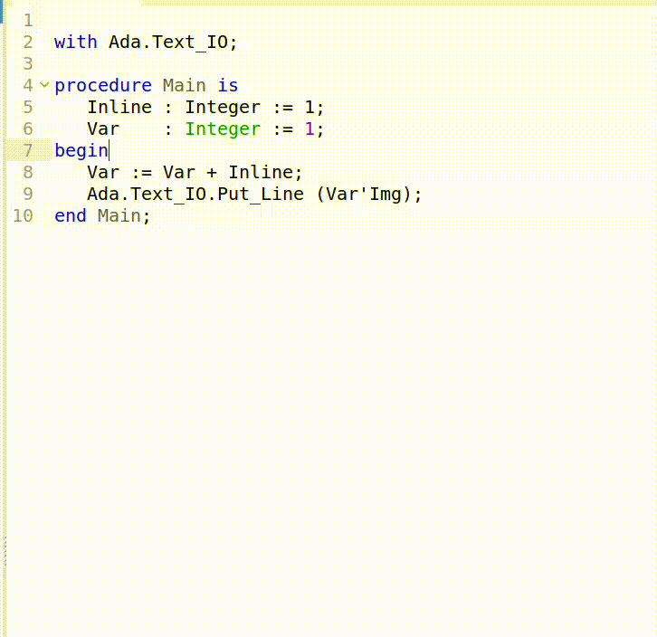

## Introduce Parameter

**Command name:** `als-refactor-introduce-parameter`

* Introduces a formal parameter based on an object declaration or expression inside a subprogram.
* All references of the object declaration or expression are replaced by the introduced parameter.
* The user must mannually fix the calls to the subprogram that was refactored by addings the corresponding actual parameter.

See `src/lal_refactor-introduce_parameter.ads` in [LAL Refactor repository](https://github.com/AdaCore/lal-refactor).

Demo source is `introduce_parameter/` in [Code Samples](https://github.com/AdaCore/ada_language_server/blob/master/integration/vscode/Code%20Samples/refactoring_demos/).

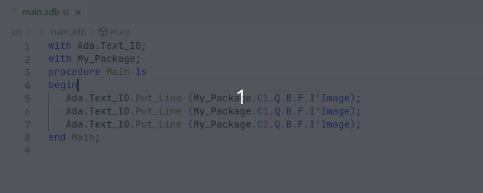

## Replace Type

**Command name:** `als-refactor-replace-type`

* Replaces a type in the intire project by another type provided by the user.

See `src/lal_refactor-replace_type.ads` in [LAL Refactor repository](https://github.com/AdaCore/lal-refactor).

Demo source is `replace_type/` in [Code Samples](https://github.com/AdaCore/ada_language_server/blob/master/integration/vscode/Code%20Samples/refactoring_demos/).

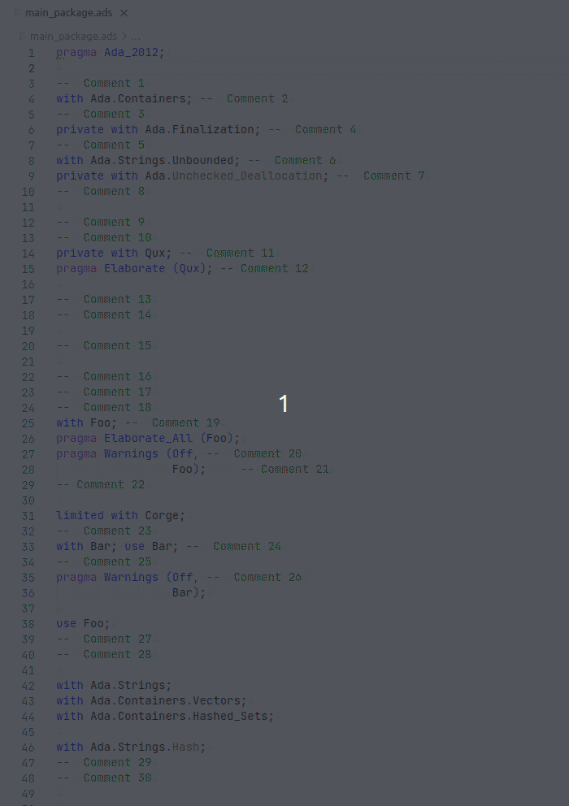

## Auto Import

**Command name:** `als-auto-import`

* For an unresolved name, suggests all packages that can be imported and prefix to be added so that that the name gets resolved.

[Source](https://github.com/AdaCore/lal-refactor/blob/main/src/lal_refactor-auto_import.adb` in [LAL Refactor repository](https://github.com/AdaCore/lal-refactor).

Demo source is `auto_import/` in [Code Samples](https://github.com/AdaCore/ada_language_server/blob/master/integration/vscode/Code%20Samples/refactoring_demos/).

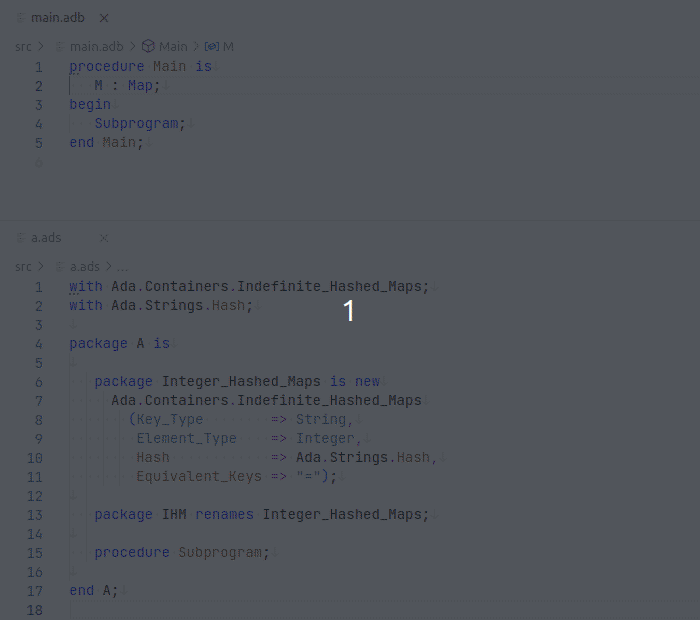

## Sort Dependencies

**Command name:** `als-refactor-sort_dependencies`

* Sorts all with and use clauses and their associated pragmas.

See `src/lal_refactor-sort_dependencies.ads` in [LAL Refactor repository](https://github.com/AdaCore/lal-refactor).

Demo source is `sort_dependencies/` in [Code Samples](https://github.com/AdaCore/ada_language_server/blob/master/integration/vscode/Code%20Samples/refactoring_demos/).

## Swap If/else statments

**Command name:** `als-refactor-swap_if_else`

* Swap If and else code branches and invert condition.

See `src/lal_refactor-swap_if_else` in [LAL Refactor repository](https://github.com/AdaCore/lal-refactor).

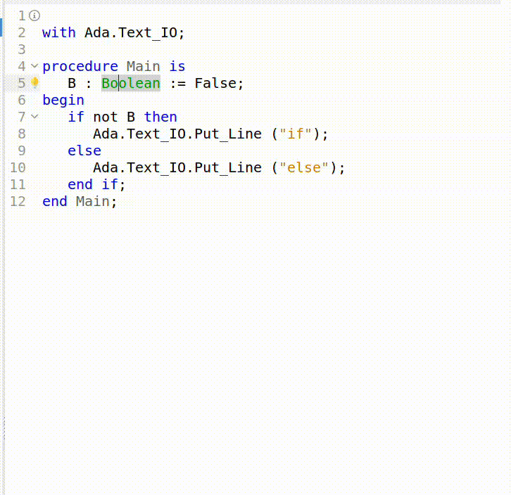
