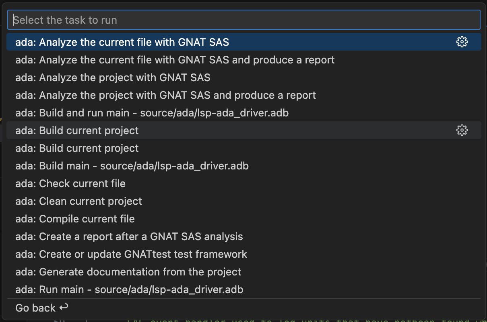
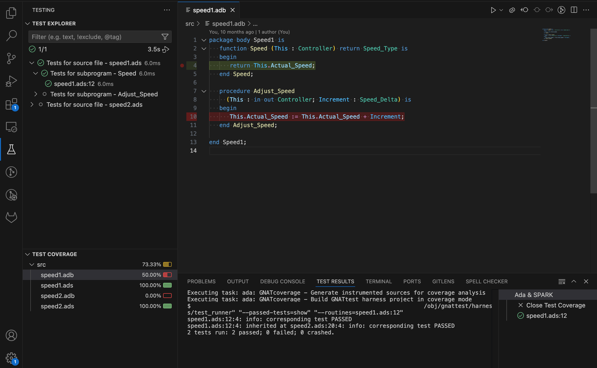

# Ada & SPARK VS Code Extension User's Guide

## Getting Started

Here are some links that will help you get familiar with the VS Code extension for Ada & SPARK:

* [Tutorial: Using Ada in VS Code](./Getting-Started.md).

## Configuration

[ALS settings](./settings.md) can be specified in various ways. For example:

- A `.als.json` file at the root of the workspace.
- A global user configuration file `$HOME/.config/als/config.json`
- The `.vscode/settings.json` VS Code workspace settings file.
- A [multi-root VS Code workspace file](https://code.visualstudio.com/docs/editor/multi-root-workspaces)
- The User or Remote or other VS Code [scopes of of settings](https://code.visualstudio.com/docs/configure/settings#_settings-precedence)

The `.als.json` file is the preferred method of defining workspace-specific settings because it applies in any IDE or editor that uses ALS. More information about configuration files can be found [here](./settings.md).

Here is an example config file that sets the project file to use and the scenario variables, as well as other useful settings (charset, whether we should show file diagnostics etc.):

```json
{
   "projectFile": "gnatcov.gpr",
   "scenarioVariables": {
      "BINUTILS_BUILD_DIR": "/null",
      "BINUTILS_SRC_DIR": "/null"
   },
   "defaultCharset": "utf-8",
   "adaFileDiagnostics": false,
   "renameInComments": false
}
```

Alternatively, the ALS can be configured in the VS Code settings UI or in the JSON settings files. For example:

```json
{
   "ada.projectFile": "gnatcov.gpr",
   "ada.scenarioVariables": {
      "BINUTILS_BUILD_DIR": "/null",
      "BINUTILS_SRC_DIR": "/null"
   },
   "ada.defaultCharset": "utf-8",
   "ada.adaFileDiagnostics": false,
   "ada.renameInComments": false
}
```

## Refactoring

See a [dedicated document](./refactoring_tools.md) with the list of available refactorings.

## VS Code Remote

The Ada extension can be used on a remote workspace over SSH thanks to the [Visual Studio Code Remote - SSH](https://marketplace.visualstudio.com/items?itemName=ms-vscode-remote.remote-ssh) extension, however there are known pitfalls regarding the environment setup.

The recommended method for environment setup in a remote configuration is to set the `terminal.integrated.env.*` settings. You can set environment variables through the VS Code Workspace or User setting `terminal.integrated.env.[linux|windows|osx]` depending on your platform.
For example:

```json
{
  "terminal.integrated.env.linux": {
    "PATH": "/path/to/my/gnat/installation/bin:${env:PATH}",
    "GPR_PROJECT_PATH": "/path/to/some-lib-1:/path/to/some-lib-2"
  }
}
```

Note that after changing this VS Code setting, the extension will display a popup asking you to reload the current window to take the environment changes into account. You can still run the `Developer: Reload Window` command manually to apply the changes later on.

In addition to Workspace and User settings, the Remote settings file can also be used to set the `terminal.integrated.env.*` settings, with standard precedence rules applying between the different setting scopes.
With this method, changes to the environment can be applied simply with the `Developer: Reload Window` command.

Another method for environment setup is possible.
According to [VS Code documentation](https://code.visualstudio.com/docs/remote/troubleshooting#_configure-the-environment-for-the-remote-extension-host) the environment of the remote extension host is based on the default shell configuration scripts such as `~/.bashrc` so it is possible to provide your toolchain and project environment setup in your default shell configuration script.
However to make changes to that environment the typical `Developer: Reload Window` command is not enough and it is necessary to fully restart the VS Code server.
To do that you must close all VS Code Remote windows, and kill all VS Code server processes on the server (e.g. `killall node` if no other `node` processes are used on the server).

## Tasks

The extension provides a number of auto-detected tasks under the `/Terminal/Run Task...` menu. These
predefined tasks are all prefixed by `ada:` and belong to the `ada` group.
They can be used to build and run your program (`ada: Build current project` task) or launch external tools such as GNAT SAS, GNATprove and a few others.



You can bind keyboard shortcuts to them by adding to the `keybindings.json` file:

```json
{
  "key": "alt+v",
  "command": "workbench.action.tasks.runTask",
  "args": "ada: Check current file",
  "when": "editorLangId == ada"
}
```

### Task Customization

You can [customize auto-detected tasks](https://code.visualstudio.com/docs/editor/tasks#_customizing-autodetected-tasks)
by providing extra tool command line options via the `args` property of the object in the `tasks.json`:

```json
{
   "version": "2.0.0",
   "tasks": [
      {
         "type": "ada",
         "command": "gprbuild",
         "args": [
            "${command:ada.gprProjectArgs}",
            "-cargs:ada",
            "-gnatef",
            "-gargs",
            "-vh"
         ],
         "problemMatcher": ["$ada-error", "$ada-warning", "$ada-info"],
         "group": "build",
         "label": "ada: Build current project"
      }
   ]
}
```

You can also customize the working directory of the task or the environment variables via the `options` property:

```json
{
   "version": "2.0.0",
   "tasks": [
      {
         "type": "ada",
         "command": "gprbuild",
         "args": [
            "${command:ada.gprProjectArgs}",
            "-cargs:ada",
            "-gnatef"
         ],
         "options": {
            "cwd": "${workspaceFolder}/my/subdir",
            "env": {
               "MY_ENV_VAR": "value"
            }
         },
         "problemMatcher": ["$ada-error", "$ada-warning", "$ada-info"],
         "group": "build",
         "label": "ada: Build current project"
      }
   ]
}
```

### Tasks for Project Mains

If your GPR project defines main programs via the project attribute `Main`, additional tasks are automatically provided for each defined main.
For example, if the project defines a `main1.adb` and `main2.adb` located under the `src/` source directory, two different tasks will be available to build a given main:

* `ada: Build main - src/main1.adb`
* `ada: Run main - src/main1.adb`

Same thing for all the predefined tasks that can have a main specified in their command line.

## Status Bar

A status bar item displaying the project-loading status and various useful commands provided by the Ada & SPARK extension (e.g `Ada: Reload Project` to reload a project after modifying it) is displayed on the left-side of the VS Code Status Bar.

  

## Alire Support

When the workspace is an Alire crate (i.e. it contains an `alire.toml` file), the extension uses Alire to determine the GPR project that should be loaded and to obtain an environment where the crate's dependencies have been provisioned.

Moreover when working with an Alire crate, VS Code tasks automatically use standard Alire commands. For example, the `ada: Build current project` task uses the command `alr build` and the `ada: Clean current project` task uses the command `alr clean`.

All other tasks use `alr exec -- ...` to execute the command in the environment provided by Alire.

## GNATtest Support

If you install GNATtest, the Ada & SPARK extension for VS Code will provide the following functionalities:

* The task `ada: Create or update GNATtest test framework` will call `gnattest` to create a test harness and test skeletons for your project automatically. You can use standard VS Code task customization to configure command line arguments to your liking in a `tasks.json` file.

* Once the test harness project is created, the task `ada: Build GNATtest test harness project` is provided automatically for building it. Command line arguments can be customized by configuring the task in a `tasks.json` file.

* Tests created with GNATtest will be loaded in the VS Code **Testing** view as follows.

  

* Tests can be executed individually or in batch through the available buttons in the interface, or through the `Test: Run All Tests` command or related commands.

* Test execution always starts by executing the `ada: Build GNATtest test harness project` task to make sure that test executables are up to date.

* Test execution results are reflected in the test tree.

  

### Using multi-root workspaces for test development

When developing tests, it is recommended to use the test harness project auto-generated by GNATtest.
You can do so by editing the `ada.projectFile` setting to point to the test harness project.
However to avoid switching back and forth between the main application project and the test harness project,
see [Working with Multiple Projects in the Same VS Code Workspace](#working-with-multiple-projects-in-the-same-vs-code-workspace) for instructions on opening the test harness project in a separate VS Code window.

### Limitations

* If you use a separate window to load the test harness project and edit tests, you have to go back to the main application project to benefit from the integration with the Test Explorer view (e.g. listing and searching for tests, running tests, etc...).
  This limitation is planned to be lifted.

* Sections of test sources delimited by `begin read only` and `end read only` comments are not really protected from inadvertant edits.
  To ensure proper interactions with GNATtest, you must refrain from making edits in those sections.

## GNATcoverage Support

GNATcoverage coverage reports can be imported in VS Code as follows:

1. Instruct GNATcoverage to produce an [XML report](https://docs.adacore.com/live/wave/gnatdas/html/gnatdas_ug/gnatcov/cov_source.html#xml-report-xml-xml)
2. Invoke the VS Code command `ada: GNATcoverage - Load an existing XML coverage report`
3. Browse to the location of the GNATcoverage XML report and select the `index.xml` file


Note that importing coverage reports does not require GNATcoverage to be installed. In particular, this enables a workflow where the coverage report is produced in CI and downloaded and imported into VS Code for visualization and analysis.

Since VS Code does not support reporting MC/DC level coverage natively, that information is imported as branch coverage.

The GNATtest integration in VS Code also supports running tests in coverage mode, if GNATcoverage is installed on the development machine.

1. Run the task `ada: GNATcoverage - Setup runtime library` once to set up the GNATcoverage runtime library
2. If you don't already have a test harness project created, use the task `ada: Create or update GNATtest test framework` to create one
3. Switch to the _Test Explorer_ view or use the `Testing: Focus on Test Explorer View` command to do that
4. Run the tests in coverage mode using the command `Test: Run All Tests with Coverage`, or use the "play" icon next to a single test or group of tests with the label _Run Test with Coverage_.
5. In one go, VS Code will:
   1. Invoke [GNATcoverage source instrumentation](https://docs.adacore.com/live/wave/gnatdas/html/gnatdas_ug/gnatcov/src_traces.html)
   1. Build the test harness project
   1. Run the tests
   1. Invoke [GNATcoverage source coverage analysis](https://docs.adacore.com/live/wave/gnatdas/html/gnatdas_ug/gnatcov/cov_source.html)
   1. Load the GNATcoverage report into VS Code



Integrating the steps of source instrumentation and test harness build into the test execution workflow allows for a quick feedback loop: run a test, observe results and coverage, edit the test or the tested code, repeat... In this context invoking the VS Code commands `Test: Rerun Last Run` and `Test: Rerun Last Run with Coverage` with their respective keyboard shortcuts can be valuable.

## Cross and Embedded Support

This section provides some guidance to work on cross or embedded projects. It assumes
that your `.gpr` project files are already properly configured to work on a cross environments/embedded platforms.

### GNATemulator Support

If you have loaded an embedded project, the extension will automatically provide predefined tasks and commands
to run and debug your application through GNATemulator, if available for your target.

For instance if you have loaded a project with an `arm-eabi` target configured to run on a STM32F4
board, the extension will provide predefined tasks, commands and CodeLenses to run and debug your
program using GNATemulator.


The port used by the debugger launched by VS Code to connect to the running GNATemulator instance
is the one specified via the `Emulator'Debug_Port` project attribute: when not set, the extension
will fallback on `localhost:1234` (GNATemulator's default debug port).

Note that GNATemulator is not available for all GNAT embedded toolchains. For more information about GNATemulator itself and its availabilty please refer to the [GNATemulator User's Guide](https://docs.adacore.com/gnatemulator-docs/gnatemulator.html).

### Remote Debugging

If your project can be debugged remotely via GDB using the `target remote <ip-of-target:port>` command, you will just need to set the `IDE'Program_Host` project attribute in your `.gpr` file to specify the address that should be used
to connect to your machine or board.

You will also need to run the debugging utility that spawns the remote `gdbserver` before launching the debugger in VS Code ( e.g: `st-util` or `openocd` for STM32F4 boards). This can be done directly through a VS Code `Terminal` or by configuring a custom [VS Code task](https://code.visualstudio.com/docs/editor/tasks) for that purpose.

Once your project is setup, just open the VS Code
`Run and Debug` panel and then click on the `Run and Debug` button.

For more advanced use cases or if your program cannot be debugged remotely via GDB, you can try creating your custom VS Code debug launch configuration following [VS Code User's Guide for Launch Configurations](https://code.visualstudio.com/docs/editor/debugging#_launch-configurations).

## Working with Multiple Projects in the Same VS Code Workspace

It is a possible for a workspace to contain multiple GPR projects.
For example, this is a typical scenario when working with GNATtest which generates (potentially multiple) test harness projects that contain test and stub sources that interface with the application code.
However, only one project can be loaded at a time with the `ada.projectFile` setting.
So you may find yourself switching back and forth between projects which can quickly become cumbersome.

This situation can be improved with [VS Code multi-root workspaces](https://code.visualstudio.com/docs/editing/workspaces/multi-root-workspaces). For example, in a workspace containing `prj1.gpr` and `prj2.gpr` it is possible to define the following two multi-root workspace files:

* `prj1.code-workspace`

  ```json
  {
    "folders": [
      {
        "path": "."
      }
    ],
    "settings": {
      "ada.projectFile": "prj1.gpr"
    }
  }
  ```

* `prj2.code-workspace`

  ```json
  {
    "folders": [
      {
        "path": "."
      }
    ],
    "settings": {
      "ada.projectFile": "prj2.gpr"
    }
  }
  ```

(while the name indicates _multi-root_, we are using a single root folder in each workspace)

Each of these workspaces can be opened in a different VS Code window, allowing to work on both projects side by side.
Alternatively, the root workspace materialized by `.vscode/settings.json` can be kept as the main workspace with `prj1.gpr`, and the other multi-root workspace is created as `prj2.code-workspace` for working with `prj2.gpr`.

In the use case of GNATtest, this allows us to load the main application project in a window and the test harness project in another window, and work on both simultaneously.

Note that a separate Ada Language Server instance is used for each VS Code window, so you might observe high memory consumption in this situation.

## Commands and Shortcuts

The extension contributes commands and a few default key bindings.
Below are a few examples, and other commands can be found by searching for `Ada:` in the command list.

### Ada: Go to other file

This command switches between specification and implementation Ada files.
The default shortcut is `Alt+O`.

### Ada: Add subprogram box

This command inserts a comment box before the current subprogram body.
The default shortcut is `Alt+Shift+B`.

### Ada: Reload project

This command reloads the current project.
The default shortcut is `None`.

### Tasks with keyboard shortcuts

The following default shortcuts are provided for tasks:

| Task                           | Shortcut        |
|--------------------------------|-----------------|
| `spark: Prove file`            | `Meta+Y Meta+F` |
| `spark: Prove subprogram`      | `Meta+Y Meta+S` |
| `spark: Prove selected region` | `Meta+Y Meta+R` |
| `spark: Prove line`            | `Meta+Y Meta+L` |

`Meta` = ⌘ on macOS, `Win` on Windows, `Meta` on Linux

These shortcuts can be customized and new shortcuts can be added for other tasks by using the command `Preferences: Open Keyboard Shortcuts (JSON)` and adding entries like the following example:

```json
{
    "command": "workbench.action.tasks.runTask",
    "args": "ada: Check current file",
    "key": "meta+y meta+c",
    "when": "editorLangId == ada && editorTextFocus"
}
```

## macOS and Apple Silicon

On macOS with Apple silicon it is possible to use either the native `aarch64` version of the GNAT compiler or the `x86_64` version running seamlessly with [Rosetta](https://support.apple.com/en-us/HT211861).
If you are using the `aarch64` version, as this is still a relatively new platform for Ada tools, it is necessary to set the following attribute in your main project file to obtain navigation and auto-completion functionalities on the standard runtime:

```ada
for Target use "aarch64-darwin";
```

If you encounter issues with the compiler on macOS, it is recommended to consult known issues at Simon Wright's [GitHub project](https://github.com/simonjwright/distributing-gcc/issues) and discussions on the [comp.lang.ada](https://groups.google.com/g/comp.lang.ada) group.

## Bug Reporting

You can use the VS Code `Issue Reporter` to report issues. Just click on the `Help -> Report Issue` menu, select `An extension` for the `File on` entry and `Language Support for Ada` for the extension name. Put as many information you can in the description, like steps to reproduce, stacktraces or system information (VS Code automatically includes it by default). This will create a GitHub issue in the [Ada Language Server](https://github.com/AdaCore/ada_language_server/) repository.

ALS log files can be found under the `~/.als` directory (`%USERPROFILE%/.als` on Windows). Feel free to attach them on the issues, it helps a lot for further investigation, specially when the `ALS.IN` and `ALS.OUT` traces are enabled (more info about traces configuration can be found [here](./traces.md).)

## Limitations and Differences with GNAT Studio

The VS Code extension has a few limitations and some differences compared to [GNAT Studio](https://github.com/AdaCore/gnatstudio):

* **Indentation/formatting**: it does not support automatic indentation when adding a newline and range/document
formatting might no succeed on incomplete/illegal code.

* **Tooling support**: we currently provide support for some _SPARK_, _GNATtest_, _GNATcoverage_, _GNAT SAS_ and _GNATemulator_ [Tasks](#tasks), but some workflows may not be supported yet.

* **Alire support**: if the root folder contains an `alire.toml` file and
  there is `alr` executable in the `PATH`, then the language server fetches
  the project's search path, environment variables and the project's file
  name from the crate description. [Tasks](#tasks) are also automatically
  invoked with Alire in this case.

* **Project support**: there is no `Scenario` view: users should configure scenarios via the _ada.scenarioVariables* setting (see the settings list available [here](./settings.md)). Saving the settings file after changing the values will automatically reload the project and update the
predefined tasks to take into account the new scenario values.

  Source directories from imported projects should be added in a [workspace file](https://code.visualstudio.com/docs/editor/workspaces#_multiroot-workspaces). If you already have a workspace file, the extension will propose you to automatically add all the source directories coming from imported projects to your workspace automatically at startup.
